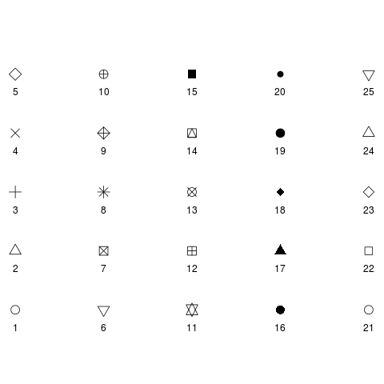

# 4. Plotting in R

##Plot basics

- As we have heard, R has extensive graphical capabilities
- ...but we need to start simple
- We will describe *base* graphics in R: the plots available with any standard R installation
    + other more advanced alternatives are, e.g., `lattice`, `ggplot2`
    + See our [intermediate R course](http://bioinformatics-core-shared-training.github.io/r-intermediate/) for fancy graphics
- Plotting in R is a *vast* topic:
    + We cannot cover everything
    + You can tinker with plots to your hearts content
    + Best to learn from examples; e.g. [The R Graph Gallery](http://www.r-graph-gallery.com/)
- ***You need to think about how best to visualise your data*** 
    + http://www.bioinformatics.babraham.ac.uk/training.html#figuredesign
- R cannot prevent you from creating a plotting disaster: 
    + http://www.businessinsider.com/the-27-worst-charts-of-all-time-2013-6?op=1&IR=T
    
##Making a Scatter Plot

- If given a single vector as an argument, the function **`plot()`** will make a scatter plot with the *values* of the vector on the *y* axis, and *indices* in the *x* axis
    + e.g. it puts a point at:
        + x = 1, y = 70.8
        + x = 2, y = 67.9 etc...
- We are going to be using the patients data frame, read using the following command

```{r}
patients <- read.delim("patient-info.txt")
```

Remember that `$` can be used to access a particular column. The result is a vector, which is the most-basic type of data used in plotting
        
```{r}
patients$Weight
```


- R tries to guess the most appropriate way to visualise the data, according to the type and dimensions of the object(s) provided


```{r}
plot(patients$Weight)
```

- Axis limits, labels, titles are inferred from the data
    + We can modify these as we wish, by specifying ***arguments***

- We can give two arguments to `plot()`:
    + In order to visualise the relationship between two variables
    + It will put the values from the *first* argument in the *x* axis, and values from the *second* argument on the *y* axis

```{r}
patients$Age
plot(patients$Age, patients$Weight)
```

##Making a barplot

- Other types of visualisation are available:
    + These are often just special cases of using the `plot()` function
    + One such function is `barplot()`
    
    
```{r}
barplot(patients$Age)
```


- It is more usual to display count data in a barplot
    + e.g. the counts of a particular ***categorical*** variable

```{r}
barplot(summary(patients$Sex))
```

##Plotting a distribution: Histogram

- A histogram is a popular way of visualising a distribution of ***continuous*** data:
    + You can change the width of bins
    + The y-axis can be either frequency of density

```{r}
hist(patients$Weight)
```


##Plotting a distribution: Boxplot

- The boxplot is commonly used in statistics to visualise a distribution:
```{r}
boxplot(patients$Weight)
```

- The black solid line is the ***median***
- The top and bottom of the box are the 75th and 25th percentiles
     + Hence, the distance between these is a reflection of the *spread* of the data; the Inter-Quartile Range (***IQR***)
- Whiskers are drawn at 1.5 x IQR and -1.5 x IQR


- Sometimes we want to compare distributions between different categories in our data
- For this we need to use the '*formula*' syntax
    + For now, `y ~ x` means put continuous variable `y` on the *y* axis and categorical `x` on the x axis
```{r}
boxplot(patients$Weight ~ patients$Sex)

```

- Other alternatives to consider:
    - `example(dotchart)`
    - `example(stripchart)`
    - `example(vioplot)  # From vioplot library`
    - `example(beeswarm) # From beeswarm library`

## Exercise: Exercise 4a

- In the course folder you will find the file `ozone.csv`:
    + Data describing weather conditions in New York City in 1973, obtained from the [supplementary data](http://faculty.washington.edu/heagerty/Books/Biostatistics/index-chapter.html) to *Biostatistics: A Methodology for the Health Sciences*
    + Full description here: http://faculty.washington.edu/heagerty/Books/Biostatistics/DATA/ozonedoc.txt
1. Read these data into R using `read.csv` or `read.delim` as described in the previous section
    + you will need to choose which is appropriate for the file type
2. What data types are present? Try to think of ways to create the following plots from the data
    + Scatter plot two variables. e.g. Solar Radiation against Ozone
    + A histogram. e.g. Wind Speed
    + Boxplot of a continuous variable against a categorical variable. e.g. Ozone level per month
    


```{r}
### Your Answer Here ###


```


## Simple customisations

- `plot()` comes with a large collection of arguments that can be set when we call the function:
    + See `?plot` and `?par`
- Recall that, unless specified, arguments have a default value
- We can choose to draw lines on the plot rather than points
    + The rest of the plot remains the same

```{r}
plot(patients$Weight, type = "l")
```


- We can also have both lines and points:

```{r}
plot(patients$Weight, type = "b")
```


- Add an informative title to the plot using the `main` argument:

```{r}
plot(patients$Age, patients$Weight,
     main = "Relationship between Weight and Age")
```


- Adding the x-axis label:
```{r}
plot(patients$Age, patients$Weight, xlab = "Age")
```

- Adding the y-axis label:

```{r}
plot(patients$Age, patients$Weight, ylab = "Weight")
```

- We can specifiy multiple arguments at once:
    + here `ylim` and `xlim` are used to specify axis limits
```{r}
plot(patients$Age,patients$Weight,
     ylab="Weight",
     xlab="Age",
     main="Relationship between Weight and Age",
     xlim=c(10,70),
     ylim=c(60,80))

```

##Defining a colour

- R can recognise various strings, such as `"red"`, `"orange"`,`"green"`,`"blue"`,`"yellow"`...
- Or more exotic ones like ``r sample(colours(),8)``...
       + See `colours()`
- See http://www.stat.columbia.edu/~tzheng/files/Rcolor.pdf
- Can also use **R**ed **G**reen **B**lue and hexadecimal values:

       + `rgb(0.7, 0.7, 0.7)` → A light grey in RGB format`
       + `"#B3B3B3"` →  The same light grey in hexadecimal
       + `"#0000FF88"`→ A semi-transparent blue, in hexadecimal
          + The hexadecimal system is the native colour system for screen visualisation (e.g. webs). It indicates the intensity of Red, Green and Blue by using two digits for each colour, in a scale from 0-9 and A-F (0 meaning no intensity and F meaning most intense)


Changing the `col` argument to `plot()` changes the colour that the points are plotted in:

```{r}
plot(patients$Age, patients$Weight, col = "red")
```


##Plotting characters

- R can use a variety of **p**lotting **ch**aracters
- Each of which has a numeric *code* 



```{r}
plot(patients$Age, patients$Weight, pch = 16)
```


- Or you can specify a character:

```{r}
plot(patients$Age, patients$Weight, pch = "X")
```


##Size of points

**C**haracter **ex**pansion: Make the size of points 3 times larger than the default

```{r}
plot(patients$Age, patients$Weight, cex = 3)
```

or 20% of the original size

```{r}
plot(patients$Age, patients$Weight, cex = 0.2)
```

##Colours and characters as vectors

- Previously we have used a *vector* of length 1 as our value of colour and character
- We can use a vector of any length:
    + the values will get *recycled* (re-used) so that each point gets assigned a value
- We can use a pre-defined ***colour palette*** (see later)

```{r}
plot(patients$Age, patients$Weight, 
     col = c("red","blue"))
```

##Other plots use the same arguments

- Other plotting functions use the same arguments as `plot()`
    + technical explanation: the arguments are *'inherited'*

```{r}
boxplot(patients$Weight~patients$Sex,
        xlab = "Sex",
        ylab = "Weight",
        main = "Relationship between Weight and Gender",
        col  = c("blue","yellow"))
```


##Exercise: exercise4b

- Can you re-create the following plots? Hint:
    + See the `breaks` and `freq` arguments to hist (`?hist`) to create 20 bins and display density rather than frequency
    + For third plot, see the rainbow function (`?rainbow`)
    + Don't worry too much about getting the colours exactly correct
    + The `las` argument changes the label orientation. See `?par`.
    + look at the arguments to `boxplot` to see how to change the names printed under each box
    


```{r}
### Your Answer Here ###


```

## More on colours

- The **`rainbow()`** function is used to create a vector of colours for the boxplot; in other words a ***palette***:
    + Red, Orange, Yellow, Green, Blue, Indigo, Violet, etc.
    + Other palette functions available: `heat.colors(), terrain.colors(), topo.colors(), cm.colors()`
    + Red, Orange, Yellow, Green, Blue, Indigo, Violet....etc

    


- More aesthetically-pleasing palettes are provided by the **`RColorBrewer`** package:
    + can also check for palettes that are accepted for those with colour-blindness
-  You may need to *install* `RColorBrewer` with the following line of code
    + remember, you only need to do this once 
    
```{r eval=FALSE}
install.packages("RColorBrewer")
```


```{r}
library(RColorBrewer)
display.brewer.all()
display.brewer.all(colorblindFriendly = TRUE)
```

```{r}
weather <- read.csv("ozone.csv")
boxplot(weather$Temp ~ weather$Month,col=brewer.pal(5,"Set1"))
```


#End of Day 1

## To come tomorrow...
- More customisation of plots
- Statistics
- Further manipulation of data
- Report writing
