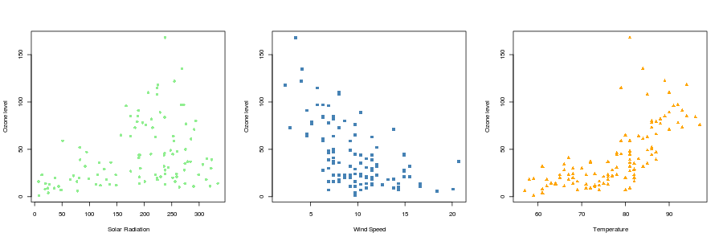
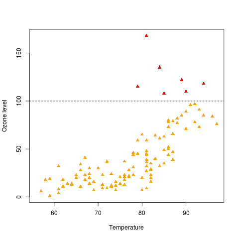

# Day 2 Schedule

1. Further customisation of plots
2. Statistics
3. Data Manipulation Techniques
4. Programming in R
5. Further report writing

#1. Further customisation of plots

## Recap

- We have seen how to use `plot()`, `boxplot()` , `hist()` etc to make simple plots
- These come with arguments that can be used to change the appearance of the plot
    + `col`, `pch`
    + `main`, `xlab`, `ylab`
    + etc....
- We will now look at ways to modify the plot appearance after it has been created
- Also, how to export the graphs 


## The painter's model

- R employs a painter's model to construct it's plots
- Elements of the graph are added to the canvas one layer at a time, and the picture built up in levels.
- Lower levels are obscured by higher levels, 
    + allowing for blending, masking and overlaying of objects.
- You can't undo the changes you make to the plot
    + you have to re-run the code from scratch
    


[http://www.inquisitr.com/309687/jesus-painting-restoration-goes-wrong-well-intentioned-old-lady-destroys-100-year-old-fresco/](http://www.inquisitr.com/309687/jesus-painting-restoration-goes-wrong-well-intentioned-old-lady-destroys-100-year-old-fresco/)


- We will re-use the patients data from yesterday:

```{r}
patients <- read.delim("patient-info.txt")
```

- Recall our patients dataset from yesterday
    + we might want to display other characteristics on the plot, e.g. gender of individual:

```{r}
plot(patients$Height, patients$Weight, pch=16)
```

##The points function

- `points()` can be used to set of points to an *existing* plot
- It requires a vector of x and y coordinates
    + These do not have to be the same length as the number of points in the initial plot:
        + Hence we can use `points()` to highlight observations
        + ...or add a set of new observations
```{r }
plot(patients$Height, patients$Weight, pch=16)
points(160,90, pch="X")
```

- Note that axis limits of the existing plot are not altered
- Often it is useful to create a blank 'canvas' with the correct labels and limits

```{r}
plot(patients$Height, patients$Weight, type="n")
```

## Adding points to differentiate gender

- Selecting males using the **`==`** comparison we saw yesterday
    + Gives a `TRUE` or `FALSE` value
    + Can be used to index the data frame
    + Which means we can get the relevant Age and Weight values
```{r}
males <- patients$Sex == "Male"
males
```

```{r, eval=FALSE}
males
patients[males,]
patients$Age[males]
patients$Weight[males]
```


- The points we add have to be within the `x` and `y` limits of the original plot axes, otherwise they won't be displayed
    + R won't give a warning or error if you attempt to plot points outside the axis limits

```{r}
plot(patients$Height, patients$Weight, type="n")
points(patients$Height[males], patients$Weight[males], 
       pch=16, col="steelblue")

```


We can do the same for Females
    
```{r}
females <- patients$Sex == "Female"
females
patients[females,]
```

- Again, we have to be careful that all the points are within the `x` and `y` limits
    + this is why creating the blank plot containing the limits of the data is useful

```{r}
plot(patients$Height, patients$Weight, type="n")
points(patients$Height[males], patients$Weight[males],
       pch=16, col="steelblue")
points(patients$Height[females], patients$Weight[females],
       pch=16, col="orangered1")

```

- Each set of points can have a different colour and shape
- Axis labels and title and limits are defined by the plot
- Once you've added points to a plot, they cannot be removed


```{r }
plot(patients$Height, patients$Weight, type="n")
points(patients$Height[males], patients$Weight[males],
       pch=16, col="steelblue")
points(patients$Height[females], patients$Weight[females],
       pch=17, col="orangered1",
        xlab="Age of Patient",
       ylab="Weight",
       main="Relationship between Age and Weights")

## The arguments xlab, ylab, main in the points functions are not used
## Need to specify these labels when you create the plot initially

```


## Adding a legend

- Should also add a legend to help interpret the plot
    + use the `legend` function
    + can give x and y coordinates where legend will appear
    + also recognises shortcuts such as ***topleft*** and ***bottomright***...

```{r}
plot(patients$Height, patients$Weight, type="n")
points(patients$Height[males], patients$Weight[males], 
       pch=16, col="steelblue")
points(patients$Height[females], patients$Weight[females],
       pch=17, col="orangered1")
legend("topleft", legend=c("M","F"), 
       col=c("steelblue","orangered1"), pch=c(16,17))
```

##Adding text

- Text can also be added to a plot in a similar manner
    + the `labels` argument specifies the text we want to add
    
```{r}
plot(patients$Height, patients$Weight, pch=16)
  text(patients$Height, patients$Weight, labels=patients$Race)
```

- In the above we used to same co-ordinates from the original plot to place the text
- We can use arguments `pos` or `adj` to offset the positions of the labels
    + `pos` can be 1, 2, 3, 4 for below, left, above, right
    + `adj` is an adjustment in the range 0 to 1

```{r}
plot(patients$Height, patients$Weight, pch=16)
  text(patients$Height, patients$Weight, labels=patients$Race,pos = 3)
```


```{r}
plot(patients$Height, patients$Weight, pch=16)
  text(patients$Height, patients$Weight, labels=patients$Race,adj =0.1)
```


- To aid our interpretation, it is often helpful to add guidelines
    + `grid()` is one easy way of doing this:
    
```{r}
plot(patients$Height, patients$Weight, pch=16)
grid(col="steelblue")
```


- Can also add lines that intersect the axes:
    + `v =` for vertical lines
    + `h =` for horizontal
    + can specify multiple lines in a vector
    
```{r}
plot(patients$Height, patients$Weight, pch=16)
abline(v=160, col="red")
abline(h=c(65,70,75), col="blue")
```


## Plot layouts

- The `par` function can be used specify the appearance of a plot
- The settings persist until the plot is closed with **`dev.off()`**
- `?par` and scroll to ***graphical parameters***
- One example is `mfrow`:
    + "multiple figures per row"
    + needs to be a vector of rows and columns:
        + e.g. a plot with one row and two columns `par(mfrow=c(1,2))`
        + don't need the same kind of plot in each cell
        
```{r}
par(mfrow=c(1,2))
plot(patients$Height, patients$Weight, pch=16)
boxplot(patients$Weight ~ patients$Sex)

```

- See also `mar` for setting the margins:
    + `par(mar=c(...))`
    
## Exporting graphs from RStudio

- You can use the `pdf()` function to export one or more plots to a pdf file:
    + You will see that the plot does not appear in RStudio
- You need to use the `dev.off()` to stop printing graphs to the pdf and 'close' the file
    + It allows you to create a pdf document with multiple pages
    
```{r}
pdf("ExampleGraph.pdf")
boxplot(patients$Weight ~ patients$Sex)
dev.off()
```

- pdf is a good choice for publication as they can be imported into Photoshop, Inkscape, etc.
    - Sometimes it is easier to edit in these tools than R!
    - If it is taking too long to customise a plot in R, consider if you should be using one of these tools instead
    

- To save any graph you have created to a pdf, repeat the code you used to create the plot with `pdf()` before and `dev.off()` afterwards
    + you can have as many lines of code in-between as you like
    + each new plot will be written to a different page
    
```{r}
pdf("mygraph.pdf")
plot(patients$Height, patients$Weight, pch=16)
abline(v=40, col="red")
abline(h=c(65,70,75), col="blue")
boxplot(patients$Weight ~ patients$Sex)
x <- 1:10
y <- x^2 + 4*x
plot(x,y)
dev.off()
```

- If no plots are appearing in RStudio, it could be you are still writing to a pdf file
    + run `dev.off()` multiple times until you see a message `cannot shut down device (the null device)`


- We can specify the dimensions of the plot, and other properties of the file (`?pdf`)

```{r}
pdf("ExampleGraph.pdf", width=10, height=5)
boxplot(patients$Weight ~ patients$Sex)
dev.off()
```

- Other formats can be created:
    + e.g. ***png***, or others `?jpeg`
    + more appropriate for email, presentations, web page
    
```{r}
png("ExampleGraph.png")
boxplot(patients$Weight ~ patients$Sex)
dev.off()
```

##Exercise: Exercise 5a
- Return to the weather data from yesterday:

```{r}
weather <- read.csv("ozone.csv")
```

- Using the `par` function, create a layout with three columns
- Plot Ozone versus Solar Radiation, Wind Speed and Temperature on separate graphs
    + use different colours and plotting characters on each plot
- Save the plot to a pdf
- HINT: Create the graph first in RStudio. When you're happy with it, re-run the code preceeded by the `pdf` function to save to a file
    + don't forget to use `dev.off()` to close the file



```{r}
### Your Answer Here ###


```


##Exercise: Exercise 5b
- Temperature and Ozone level seem to be correlated
- However, there are some observations that do not seem to fit the trend
    + those with Ozone level > 100
- Modify the plot so that these outlier observations are in a different colour
- Add a legend to help interpret the plot





HINT: You can break down the problem into the following steps

- Create a blank plot
- Identify observations with ozone > 100
    + plot the corresponding Temperature and Ozone values for these in red
- Identify observations with ozone < 100
    + plot the corresponding Temperature and Ozone values for these in orange
- Can you modify your code so that the cut-off is not hard-coded (fixed) to 100
    + e.g. Ozone > 80, Ozone, 90 etc...
    + can you re-generate the plots the minimal changes to the code

```{r}

### Your Answer Here ###


```

An alternative, and equally-valid, solution involves creating a vector of colours which will either be `red` or `orange` depending whether on the particular value of ozone is an outlier

- we can use the `rep` function to create a vector of the required length for the entire dataset
    + one vector for plotting colours, and another vector for plotting characters
    
```{r}
weather <- read.csv("ozone.csv")
mycol <-rep("orange",nrow(weather))
mypch <- rep(17, nrow(weather))

```

- now use a logical expression to identify the high ozone level, and replace the corresponding entries in the colour and plotting character vectors

```{r}
highO <- which(weather$Ozone > 100)
mycol[highO] <- "red"
mypch[highO] <- 18
```

- creating the plot can now be done with a single `plot` command

```{r}
plot(weather$Temp,weather$Ozone, 
     col=mycol, pch=mypch,ylab="Ozone level",
     xlab="Temperature")
abline(h=100,lty=2)
legend("topleft", legend = c("Ozone > 100","Normal Ozone"),col=c("red","orange"),pch=17)
```

## Other plotting features

We can choose not to show the x- and y-axis in the initial plot

```{r}
plot(patients$Age, patients$Weight, pch=16,axes=FALSE)
```

They can be added afterwards with the `axis` function
    - first argument is whether the axis appears on the bottom (1), left (2), top (3) or right (4)
    - can also define where the tick marks are located, and the labels to display
    - the `box` function can be used to enclose the plot in a box
```{r}
plot(patients$Age, patients$Weight, pch=16,axes=FALSE)
axis(1)
axis(4, at = c(65,75,85,95),labels = c("65kg","75kg","85kg","95kg"))
box()

```


## Ordering the boxes in a set of boxplots

N.B. The order in which the boxes are displayed on a boxplot isn't something that can be controlled by graphical paramaters

- the order is derived from the order of the categories
    + in this case `Female` comes first alphabetically

```{r}
boxplot(patients$Weight~patients$Sex)
```

- a different order can be achieved by defining a new factor where the `levels` are in the order you want

```{r}
patients$Sex <- factor(patients$Sex,levels = c("Male","Female"))
boxplot(patients$Weight~patients$Sex)
```


## Need inspiration?

The [R Graph Gallery](http://www.r-graph-gallery.com/) has lots of examples (and code) showing what can be achieved with R graphics