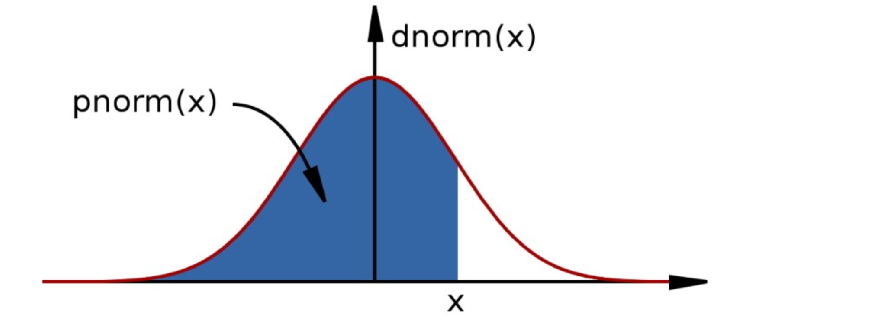
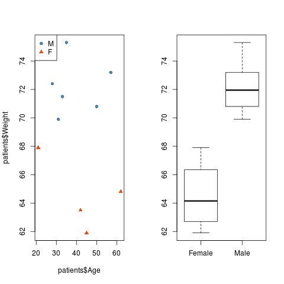

# 2. Statistics
##Built-in support for statistics
- R is a statistical programming language:
    + Classical statistical tests are built-in
    + Statistical modeling functions are built-in
    + Regression analysis is fully supported
    + Additional mathematical packages are available (`MASS`, Waves, sparse matrices, etc)
  
##Distribution functions  
- Most commonly used distributions are built-in, functions have stereotypical names, e.g. for normal distribution:
    + **`pnorm`** - cumulative distribution for x
    + **`qnorm`** - inverse of pnorm (from probability gives x)
    + **`dnorm`** - distribution density
    + **`rnorm`** - random number from normal distribution
  
  
  
- Available for variety of distributions: `punif` (uniform), `pbinom` (binomial), `pnbinom` (negative binomial), `ppois` (poisson), `pgeom` (geometric), `phyper` (hyper-geometric), `pt` (T distribution), pf (F distribution) 

##Distribution functions 
- 10 random values from the Normal distribution with mean 10 and standard deviation 5:
```{r}
rnorm(10, mean=10, sd=5)
```
- The probability of drawing exactly 10 from this distribution:
```{r}
dnorm(10, mean=10, sd=5)
```

```{r}
dnorm(100, mean=10, sd=5)
```

##Distribution functions (continued)

- The probability of drawing a value smaller than 10:
```{r}
pnorm(10, mean=10, sd=5)
```
- The inverse of `pnorm()`:
```{r}
qnorm(0.5, mean=10, sd=5)
```
- How many standard deviations for statistical significance?
```{r}
qnorm(0.95, mean=0, sd=1)
```

## Example

Recall our histogram of Wind Speed from yesterday:

- The data look to be roughly normally-distributed
- An assumption we rely on for various statistical tests

```{r}
weather <- read.csv("ozone.csv")
hist(weather$Wind, col="purple", xlab="Wind Speed",
     main="Distribution of Wind Speed",
     breaks = 20, freq=FALSE)
```

## Create a normal distribution curve

- If our data are normally-distributed, we can calculate the probability of drawing particular values.
      + e.g. a Wind Speed of 10

```{r}
tempMean <- mean(weather$Wind)
tempSD <- sd(weather$Wind)
dnorm(10, mean=tempMean, sd=tempSD)
```

- We can overlay this on the histogram using `points` as we just saw:
```{r}
hist(weather$Wind, col="purple", xlab="Wind Speed",
     main="Distribution of Wind Speed",
     breaks = 20, freq=FALSE)
points(10, dnorm(10, mean=tempMean, sd=tempSD),
       col="red", pch=16)
```

- We can repeat the calculation for a vector of values
    + remember that functions in R are often ***vectorized***
    + use `lines` in this case rather than `points`
    
```{r}
xs <- c(0,5,10,15,20)
ys <- dnorm(xs, mean=tempMean, sd=tempSD)
hist(weather$Wind, col="purple", xlab="Wind Speed",
     main="Distribution of Wind Speed",
     breaks = 20, freq=FALSE)
lines(xs, ys, col="red")
```


## Create a normal distribution curve

- For a smoother curve, use a longer vector:
    + we can generate x values using the `seq()` function
- Inspecting the data in this manner is usually acceptable to assess normality
    + the fit doesn't have to be exact
    + the shapiro test is also available `?shapiro.test` (but not really recommended by statisticians)


```{r}
hist(weather$Wind,col="purple",xlab="Wind Speed",
     main="Distribution of Wind Speed",breaks = 20,freq=FALSE)
xs <- seq(0,20, length.out = 10000)
ys <- dnorm(xs, mean=tempMean,sd=tempSD)
lines(xs,ys,col="red")
```

## Simple testing

- If we want to compute the probability of observing a particular Wind Speed, from the same distribution, we can use the standard formula to calculate a t statistic:

$$t = \frac{\bar{x} -\mu_0}{s / \sqrt(n)}$$

- Say a Wind Speed of 2; which from the histogram seems to be unlikely

```{r}
t <- (tempMean - 2) / (tempSD/sqrt(length(weather$Wind)))
t
```

- ...or use the **`t.test()`** function to compute the statistic and corresponding p-value

```{r}
t.test(weather$Wind, mu=2)
```

- A variety of tests are supported the R authors have tried to make them as consistent as possible

```{r}
?var.test
?t.test
?wilcox.test
?prop.test
?cor.test
?chisq.test
?fisher.test
```

    
- Bottom-line: Pretty much any statistical test you care to name will probably be in R
    + This is not supposed to be a statistics course (sorry!)
    + None of them are particular harder than others to use
    + The difficulty is deciding which test to use:
        + whether the assumptions of the test are met, etc.
    + Consult your local statistician if not sure
    + An upcoming course that will help
        + [Introduction to Statistical Analysis](http://bioinformatics-core-shared-training.github.io/IntroductionToStats/)
    + Some good references:
        + [Statistical Analysis Using R (Course from the Babaraham Bioinformatics Core)](http://training.csx.cam.ac.uk/bioinformatics/event/1827771)
        + [Quick-R guide to stats](http://www.statmethods.net/stats/index.html)
        + [Simple R eBook](https://cran.r-project.org/doc/contrib/Verzani-SimpleR.pdf)
        + [R wiki](https://en.wikibooks.org/wiki/R_Programming/Descriptive_Statistics)
        + [R tutor](http://www.r-tutor.com/elementary-statistics)
        + [Statistical Cheatsheet](https://rawgit.com/bioinformatics-core-shared-training/intermediate-stats/master/cheatsheet.pdf)

## Example analysis

- We have already seen that men in our `patients` dataset tend to be heavier than women
- We can **test this formally** in R



We need to run this if we don't have the patients data in our R environment
```{r}
source("create-patients-data.R")
```


The `t.test` can also be used to test for the difference between two groups

## Exercise: Exercise 6

- Use the `t.test` function to assess whether there is significant difference between the weights of males and females
    + you will need to create two vectors; one for the weight of females and one for the weight of males
    + use the help page `?t.test` to decide how to tell `t.test` to use these values as input

```{r}

male.weight <- patients$Weight[patients$Sex == "Male"]
## Your Answer here ##

```

- This function can be tuned in various ways (`?t.test`):
    - Assumed equal variances, or not
    - Deal with paired samples
    - Two-sided, or one-sided test

Look at the help page for `t.test`, which parameter do you think you would change if you wanted to assume equal variances?
    + usually you would decide based on the plots
    + the `var.test` function can also be used, but is not completely reliable
    
    
```{r}


```


##Linear regression: Basic data analysis

- Linear modeling is supported by the function **`lm()`**:
    + `example(lm)` 
    + The output assumes you know a fair bit about the subject

- `lm` is really useful for plotting lines of best fit to XY data, in order to determine intercept, gradient and Pearson's correlation coefficient


## Example:

- There are suggestions that Ozone level could be influenced by Temperature:
- Three steps fitting a model and plotting with a best fit line:
    1. Plot XY scatter-plot data
    2. Fit a linear model
    3. Add bestfit line data to plot with `abline()` function

1. Produce the scatter plot
  - make sure you put the variables on the correct axes

```{r }
weather <- read.csv("ozone.csv")
plot(weather$Temp, weather$Ozone)
```

2. Fit the linear model

- The `~` (tilde) is used to define a formula; i.e. “y is given by x”
- `summary` will give a summary of the model (assuming you know something about linear models)

```{r}

myModel <- lm(weather$Ozone~weather$Temp)
summary(myModel)
```

- It is important to visualize the fit, which can be done using the `abline` function
    + we have already seen `abline` for adding horizontal and vertical lines, here it is being used to plot a line with a particular gradient and intercept

```{r}
plot(weather$Temp,weather$Ozone)
abline(myModel)
```

Some helpful functions can be used to access particular information from the model
    
```{r}

coef(myModel)   # Coefficients
resid(myModel)  # Residuals
fitted(myModel) # Fitted values
residuals(myModel) + fitted(myModel) # what values does this give?

```

If you want, you can also dig into the details of how well the model fits the data

- Some explanation is given [here](http://data.library.virginia.edu/diagnostic-plots/) and [here](http://strata.uga.edu/6370/rtips/regressionPlots.html)

```{r}
par(mfrow=c(2,2)) 
plot(myModel)
```


##Modelling formulae
- R has a very powerful formula syntax for describing statistical models
- Suppose we had two explanatory variables `x` and `z`, and one response
variable `y`
- We can describe a relationship between, say, `y` and `x` using a tilde `~`,
placing the response variable on the left of the tilde and the explanatory variables on the right:
    + `y~x`
- It is very easy to extend this syntax to do multiple regressions, ANOVAs, to include interactions, and to do many other common modelling tasks. For example
```{r eval=FALSE}
y~x       #If x is continuous, this is linear regression
y~x       #If x is categorical, ANOVA
y~x+z     #If x and z are continuous, multiple regression
y~x+z     #If x and z are categorical, two-way ANOVA
y~x+z+x:z # : is the symbol for the interaction term
y~x*z     # * is a shorthand for x+z+x:z
```


## Word of caution

R will do whatever you ask it, it will never check the assumptions or help you to interpret the result


***Correlation != Causation***


http://tylervigen.com/spurious-correlations

## Word of caution


[So if I want to win a nobel prize, I should eat even more chocolate?!?!?](http://www.businessinsider.com/chocolate-consumption-vs-nobel-prizes-2014-4?IR=T)

But no-one would ever take such trends seriously....would they?

## Wrong!


