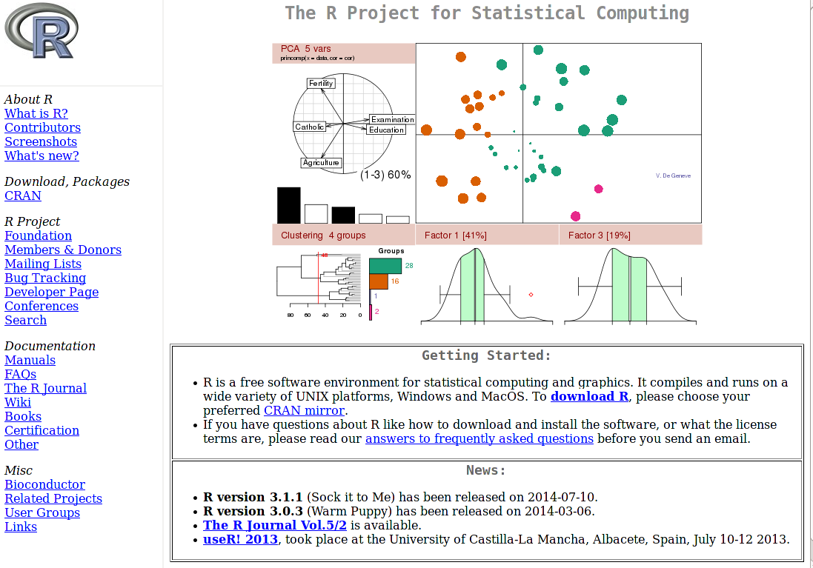
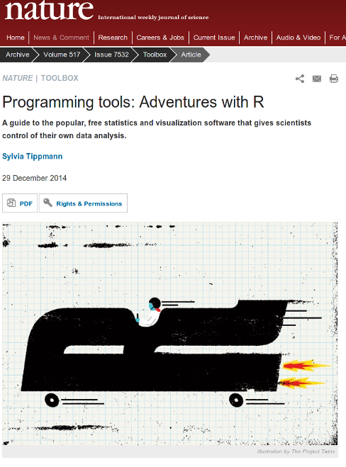
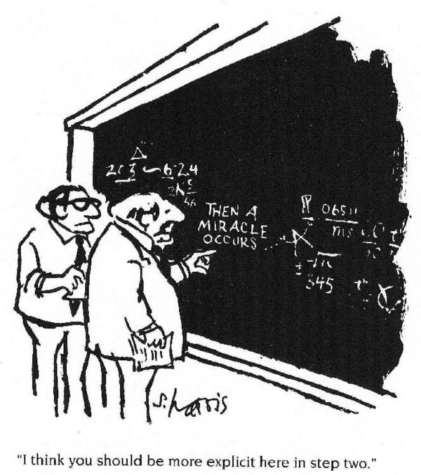
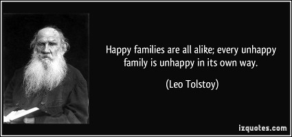

```{r include = FALSE}
library(knitr)
opts_chunk$set(comment = NA) # eliminates hashtag from R outputs
```

## Course Aims

- To introduce you to the basics of R
    + Reading data
    + Perform simple analyses
    + Producing graphs
    + ***How to get help!***
- Give you all the background you need to ***practice*** by yourselves
- Introduce tools that will help you to work in a ***reproducible*** manner

## Day 1 Schedule

1. Introduction to R and its environment
2. Data Structures
3. Data Analysis Example
4. Plotting in R

#1. Introduction to R and its environment

##What's R?

* A statistical programming environment
    + based on 'S'
    + suited to high-level data analysis
* Open source and cross platform
* Extensive graphics capabilities
* Diverse range of add-on packages
* Active community of developers
* Thorough documentation


## The R-project page

http://www.r-project.org/



##R in the New York Times
http://goo.gl/pww4ZO


##R in Nature


##R plotting capabilities
http://spatial.ly/2012/02/great-maps-ggplot2/


##R plotting capabilities
https://www.facebook.com/notes/facebook-engineering/visualizing-friendships/469716398919


##Who uses R? Not just academics!
http://www.revolutionanalytics.com/companies-using-r

- Facebook
    + http://blog.revolutionanalytics.com/2010/12/analysis-of-facebook-status-updates.html
- Google
    + http://blog.revolutionanalytics.com/2009/05/google-using-r-to-analyze-effectiveness-of-tv-ads.html
- Microsoft
    + http://blog.revolutionanalytics.com/2014/05/microsoft-uses-r-for-xbox-matchmaking.html
- New York Times
    + http://blog.revolutionanalytics.com/2011/03/how-the-new-york-times-uses-r-for-data-visualization.html

## R can facilitate Reproducible Research



Sidney Harris - New York Times

##It is a hot topic at the moment

- Statisticians at MD Anderson tried to reproduce results from a Duke paper and unintentionally unravelled a web of incompetence and skullduggery
    + as reported in the ***New York Times***
    


##Hear the full account

- Very entertaining talk from Keith Baggerly in Cambridge, December 2010

<iframe width="560" height="315" src="https://www.youtube.com/embed/7gYIs7uYbMo" frameborder="0" allowfullscreen></iframe>

##Various platforms supported

- Release 3.2.2 (August 2015)
    + Base package and Contributed packages (general purpose extras)
    + `r length(XML:::readHTMLTable("http://cran.r-project.org/web/packages/available_packages_by_date.html")[[1]][[2]])` available packages as of `r date()`
- Download from http://mirrors.ebi.ac.uk/CRAN/
- Windows, Mac and Linux versions available
- Executed using command line, or a graphical user interface (GUI)
- On this course, we use the RStudio GUI (www.rstudio.com)
- Everything you need is installed on the training machines
- If you are using your own machine, download both R and RStudio


##Getting started

- R is a program which, once installed on your system, can be
launched and is immediately ready to take input directly from the
user
- There are two ways to launch R:
    + From the command line (particularly useful if you're quite
familiar with Linux; in the console at the prompt simply type `R`)
    + As an application called  (very good for beginners)
    
##Launching R Using RStudio

To launch RStudio, find the RStudio icon in the menu bar on the left
of the screen and click


##Basic concepts in R - command line calculation

- The command line can be used as a calculator. Type:

```{r basic-calc1, eval=FALSE}
2 + 2

20/5 - sqrt(25) + 3^2

sin(pi/2)

```

Note: The number in the square brackets is an indicator of the
position in the output. In this case the output is a 'vector' of length 1
(i.e. a single number). More on vectors coming up...

##Basic concepts in R - variables

- A variable is a letter or word which takes (or contains) a value. We use the **assignment operator: `<-`**
```{r variables1, eval=FALSE}
x <- 10
x

myNumber <- 25
myNumber
```

- We can perform arithmetic on variables:
```{r variables2, eval=FALSE}
sqrt(myNumber)
```

##Basic concepts in R - variables

- We can add variables together:
```{r variables3, eval=FALSE}
x + myNumber
```

- We can change the value of an existing variable:
```{r variables4, eval=FALSE}
x <- 21
x
```

##Basic concepts in R - variables

- We can set one variable to equal the value of another variable:
```{r variables5, eval=FALSE}
x <- myNumber
x
```

- We can modify the contents of a variable:

```{r variables6, eval=FALSE}
myNumber <- myNumber + sqrt(16)
myNumber
```

##Basic concepts in R - functions

- **Functions** in R perform operations on **arguments** (the inputs(s) to the function). We have already used:
```{r eval=FALSE}
sin(x)
```
- This returns the sine of x
     + In this case the function has one argument: **x**. Arguments are always contained in parentheses -- curved brackets, **()** -- separated by commas.

- Try these:

```{r functions1, eval=FALSE}
sum(3,4,5,6)
max(3,4,5,6)
min(3,4,5,6)
```

##Basic concepts in R - functions

- Arguments can be named or unnamed, but if they are unnamed they must be ordered (we will see later how to find the right order)

```{r functions2, eval=FALSE}
seq(from = 2, to = 20, by = 4)
seq(2, 20, 4)
```
- When testing code, it is easier and safer to name the arguments

##Basic concepts in R - vectors

- The basic data structure in R is a **vector** -- an ordered collection of values. 
- R treats even single values as 1-element vectors. 
- The function **`c`** *combines* its arguments into a vector:

```{r vectors1, eval=FALSE}
x <- c(3,4,5,6)
x
```
- The square brackets `[]` indicate the position within the vector (the ***index***).
- We can extract individual elements by using the `[]` notation:
```{r vectors2, eval=FALSE}
x[1]
x[4]
```

##Basic concepts in R - vectors

- We can even put a vector inside the square brackets (*vector indexing*):

```{r vectors3, eval=FALSE}
y <- c(2,3)
x[y]
```

##Basic concepts in R - vectors

- There are a number of shortcuts to create a vector. 
- Instead of:
```{r vectors4}
x <- c(3, 4, 5, 6, 7, 8, 9, 10, 11, 12)
```
- we can write:
```{r vectors5, eval=FALSE}
x <- 3:12
x
```

##Basic concepts in R - vectors

- or we can use the **`seq()`** function, which returns a vector:
```{r vectors6, eval=FALSE}
x <- seq(2, 20, 4)
x
```

```{r vectors7, eval=FALSE}
x <- seq(2, 20, length.out=5)
x
```

- or we can use the **`rep()`** function:

```{r vectors8, eval=FALSE}
y <- rep(3, 5)
y
```

```{r vectors9, eval=FALSE}
y <- rep(1:3, 5)
y
```

##Basic concepts in R - vectors

- We have seen some ways of extracting elements of a vector. We can use these shortcuts to make things easier (or more complex!)

```{r vectors10, eval=FALSE}
x <- 3:12

x[3:7]
x[seq(2, 6, 2)]
x[rep(3, 2)]
```

##Basic concepts in R - vectors

- We can add an element to a vector:
```{r vectors11, eval=FALSE}
y <- c(x, 1)
y
```
- We can glue vectors together:
```{r vectors12, eval=FALSE}
z <- c(x, y)
z
```

##Basic concepts in R - vectors

- We can remove element(s) from a vector:
```{r vectors13, eval=FALSE}
x <- 3:12

x[-3]
x[-(5:7)]
x[-seq(2, 6, 2)]
```

##Basic concepts in R - vectors

- Finally, we can modify the contents of a vector:
```{r vectors14, eval=FALSE}
x[6] <- 4
x

x[3:5] <- 1
x
```

**Remember!**

 - **Square** brackets [ ] for ***indexing***
 - **Parentheses** () for function ***arguments***

##Basic concepts in R - vector arithmetic

- When applying all standard arithmetic operations to vectors,
application is element-wise

```{r vector-arithmetic1}
x <- 1:10
y <- x*2
```
```{r eval=FALSE}
y
```
```{r vector-arithmetic1b}
z <- x^2
```
```{r eval=FALSE}
z
```

##Basic concepts in R - vector arithmetic

- Adding two vectors:
```{r vector-arithmetic2, eval=FALSE}
y + z
```
- If vectors are not the same length, the shorter one will be recycled:
```{r vector-arithmetic3, eval=FALSE}
x + 1:2
```
- But be careful if the vector lengths aren't factors of each other:

```{r eval=FALSE}
x + 1:3
```

```{r vector-arithmetic4,echo=FALSE}
options(width=50)
x + 1:3
```


##Basic concepts in R - Character vectors and naming

- All the vectors we have seen so far have contained numbers, but we can also store text (/"strings") in vectors -- this is called a **character** vector.

```{r vector-naming1}
gene.names <- c("Pax6", "Beta-actin", "FoxP2", "Hox9")
gene.names
```

##Basic concepts in R - Character vectors and naming

- We can name elements of vectors using the **`names()`** function, which can be useful to keep track of the meaning of our data:
```{r vector-naming2}
gene.expression <- c(0, 3.2, 1.2, -2)
names(gene.expression) <- gene.names
gene.expression

```

- We can also use the `names()` function to get a vector of the names of an object:
```{r vector-naming4, eval=FALSE}
names(gene.expression)
```

##Exercise: genes and genomes
- Let's try some vector arithmetic. Here are the genome lengths and number of protein coding genes for several model organisms:

|Species | Genome size (Mb) | Protein coding genes|
|-------|------------------:|-------------------:|
|*Homo sapiens*|3,102|20,774|
|*Mus musculus*|2,731|23,139|
|*Drosophila melanogaster*|169|13,937|
|*Caenorhabditis elegans*|100|20,532|
|*Saccharomyces cerevisiae*|12|6,692|

- Create *genome.size* and *coding.genes* vectors to hold the data in each column using the `c` function. Create a *species.name* vector and use this vector to name the values in the other two vectors.

##Exercise: genes and genomes

1. Let's assume a coding gene has an average length of 1.5 kilobases. On average, **how many base pairs of each genome is made of coding genes?** Create a new vector to record this, called **`coding.bases`**.
2. **What percentage of each genome is made up of protein coding genes?** Use your **`coding.bases`** and **`genome.size`** vectors to calculate this. (See earlier slides for how to do division in R.)
3. How many times more bases are used for coding in the human genome compared to the yeast genome? (*S. cerevisiae*) **How many times more bases are in the human genome in total compared to the yeast genome?** Look up indices of your vectors to find out.

##Answers to genome exercise

```{r ex1answers1}
genome.size  <- c(3102, 2731, 169, 100, 12)
coding.genes <- c(20774, 23139, 13937, 20532, 6692)
species.name <- c("H. sapiens","M. musculus",
                  "D. melanogaster","C. elegans",
                  "S. cerevisiae")

names(genome.size)  <- species.name
names(coding.genes) <- species.name
```

##Answers to genome exercise

1. To calculate the number of coding bases, we need to use the same scale as we used for genome size (1.5 kilobases is 0.0015 Megabases):
```{r ex1answers2}
coding.bases <- coding.genes*0.0015
coding.bases
```

##Answers to genome exercise

2. To calculate the percentage of coding bases in each genome:

```{r ex1answers3}
coding.pc <- coding.bases/genome.size*100
coding.pc
```

##Answers to genome exercise

3. To compare human to yeast:
```{r ex1answers4}
coding.bases[1]/coding.bases[5]
```

```{r ex1answers5}
genome.size[1]/genome.size[5]
```

##Answers to genome exercise

- Names are usually carried across to the new vector. Sometimes this is what we want (as for `coding.pc`) but sometimes it is not (when we are comparing human to yeast). We can remove names by setting them to the special `NULL` value:

```{r ex1answers6}
names(coding.pc) <- NULL
coding.pc
```

## Documenting your analysis with RStudio

Typing lots of commands directly to R can be tedious. A better way is to write the commands to a file and then load it into R.

- We will be documenting our analyses using ***markdown***
    + markdown is a easy-to-read, easy-to-write text format often used to write HTML, readme files, etc.
    + a simpler (but not so informative) alternative is to use a script
    
- To create an R markdown file, Click on **File** →  **New File**  →  **R Markdown** in Rstudio
- This will make our analyses ***reproducible***

## Format of an R markdown file

- **Lines 8 - 10**: plain text description
- **Lines 12 - 14**: an R code 'chunk'
- **Lines 18 to 20**: another code chunk, this time producing a plot


- Pressing the ***Knit HTML*** (/***Knit PDF***) button will create a report
- See `solution-exercise1.Rmd ` for solution to Exercise 1
- All exercises have a markdown template that you can edit

##Getting help

- **This is possibly the most important slide in the whole course!?!**
- To get help on any R function, type **`?`** followed by the function name. For example:
```{r eval=FALSE}
?seq
```
- This retrieves the syntax and arguments for the function. The help page shows the default order of arguments. It also tells you which *package* it belongs to.
- There is typically a usage example, which you can test using the
`example` function:

```{r eval=FALSE}
example(seq)
```

##Getting help

- If you can't remember the exact name, type **`??`** followed by your guess.
R will return a list of possibilities:

```{r eval=FALSE}
??plot
```
- The **Packages** tab in the lower-right panel of RStudio will help you locate the help pages for a particular package and its functions
    + Often there will be a user-guide or '*vignette*' too

##Interacting with the R console

- **Important** -- R console symbols:
    + **`;`** end of line
    (Enables multiple commands to be placed on one line of text)
    + **`#`** comment
    (indicates text is a comment and not executed)
    + **`+`** command line wrap
    (R is waiting for you to complete an expression)
    
- *Ctrl-c* or *escape* to clear input line and try again
- *Ctrl-l* to clear window
- Use the *TAB* key for command auto completion
- Use up and down arrows to scroll through the command history

##R packages

- R comes ready loaded with various libraries of functions called
**packages**. For example: the function **`sum()`** is in the **base** package and
**`sd()`**, which calculates the standard deviation of a vector, is in the
**`stats`** package
- There are 1000s of additional packages provided by third parties,
and the packages can be found in numerous server locations on the
web called **repositories**
- The two repositories you will come across the most are:
    + **The Comprehensive R Archive Network (CRAN)**
        + Use metacran search to find functionality you need: http://www.r-pkg.org/
        + Or look for packages by theme: http://cran.r-project.org/web/views/
    + **Bioconductor** specialised in genomics: http://www.bioconductor.org/packages/release/bioc/
    
##R packages
    
- Other repositories:
    + http://r-forge.r-project.org/
    + https//github.com can also host R packages, and hosts the development version of many packages
- Bottomline: ***always*** first look if there is already an R package that does what you want before trying to implement it yourself
    
## Installing packages    
    
- CRAN packages can be installed using **`install.packages()`**
    + or clicking on the *Packages* tab in RStudio
    
```{r eval=FALSE}
install.packages(name.of.my.package)
```


- Set the Bioconductor package download tool by typing:
```{r eval=FALSE}
source("http://bioconductor.org/biocLite.R")
```

- Bioconductor packages are then installed with the `biocLite()` function:
```{r eval=FALSE}
biocLite("PackageName")
```

##Example: Install packages ggplot2 and DESeq

- ggplot2 is a commonly used graphics package:
    + in RStudio, go to **Tools** → **Install Packages**... and type the package name
    + or use `install.packages()` function to install it:
  
```{r eval=FALSE}
install.packages("ggplot2")
```
   
- `DESeq` is a Bioconductor package (http://www.bioconductor.org) for the analysis of RNA-seq data:

```{r eval=FALSE}
source("http://www.bioconductor.org/biocLite.R")
biocLite("DESeq")
```

##Example: Load packages ggplot2 and DESeq

- R needs to be told to use the new functions from the installed packages. Use **`library(...)`** function to load the newly installed features:

```{r eval=FALSE}
library(ggplot2) # loads ggplot functions
library(DESeq)   # loads DESeq functions
library()        # Lists all the packages 
                 # you've got installed 
```

# 2. Data structures

##R is designed to handle experimental data

- Although the basic unit of R is a vector, we usually handle data in **data frames**.
- A data frame is a set of observations of a set of variables -- in other words, the outcome of an experiment.
- For example, we might want to analyse information about a set of patients. 
- To start with, let's say we have ten patients and for each one we know their name, sex, age, weight and whether they give consent for their data to be made public.


##The patients data frame
- We are going to create a data frame called 'patients', which will have ten rows (observations) and seven columns (variables). The columns must all be equal lengths. 
- We will explore how to construct these data from scratch.
    + (in practice, we would usually import such data from a file)

```{r echo=FALSE, tidy=T}
age    <- c(50, 21, 35, 45, 28, 31, 42, 33, 57, 62)
weight <- c(70.8, 67.9, 75.3, 61.9, 72.4, 69.9, 63.5, 
            71.5, 73.2, 64.8)
firstName <- c("Adam", "Eve", "John", "Mary", "Peter", 
               "Paul", "Joanna", "Matthew", "David", "Sally")
secondName <- c("Jones", "Parker", "Evans", "Davis", 
                "Baker","Daniels", "Edwards", "Smith", "Roberts", "Wilson")
consent <- c(TRUE, TRUE, FALSE, TRUE, FALSE, FALSE,
             FALSE, TRUE, FALSE, TRUE)
sex <- c("Male", "Female", "Male", "Female", "Male", "Male",
         "Female", "Male", "Male", "Female")
patients <- data.frame(firstName, secondName, 
                       paste(firstName, secondName),  
                       sex, age, weight, consent)
names(patients) <- c("First_Name", "Second_Name", 
                     "Full_Name", "Sex", "Age", "Weight", "Consent")
kable(patients)
```

<!-- |  |First_Name|Second_Name|Full_Name|Sex |Age|Weight |Consent| -->
<!-- |--|-------|-------|--------------|:----:|--:|------:|:-----:| -->
<!-- |1 |Adam   |Jones  |Adam Jones    |  Male|50 |  70.8 |   TRUE| -->
<!-- |2 |Eve    |Parker |Eve Parker    |Female|21 |  67.9 |   TRUE| -->
<!-- |3 |John   |Evans  |John Evans    |  Male|35 |  75.3 |  FALSE| -->
<!-- |4 |Mary   |Davis  |Mary Davis    |Female|45 |  61.9 |   TRUE| -->
<!-- |5 |Peter  |Baker  |Peter Baker   |  Male|28 |  72.4 |  FALSE| -->
<!-- |6 |Paul   |Daniels|Paul Daniels  |  Male|31 |  69.9 |  FALSE| -->
<!-- |7 |Joanna |Edwards|Joanna Edwards|Female|42 |  63.5 |  FALSE| -->
<!-- |8 |Matthew|Smith  |Matthew Smith |  Male|33 |  71.5 |   TRUE| -->
<!-- |9 |David  |Roberts|David Roberts |  Male|57 |  73.2 |  FALSE| -->
<!-- |10|Sally  |Wilson |Sally Wilson  |Female|62 |  64.8 |   TRUE| -->

##Character, numeric and logical data types

- Each column is a vector, like previous vectors we have seen, for 
example: 

```{r patients1}
age    <- c(50, 21, 35, 45, 28, 31, 42, 33, 57, 62)
weight <- c(70.8, 67.9, 75.3, 61.9, 72.4, 69.9, 
            63.5, 71.5, 73.2, 64.8)

```
- We can define the names using character vectors:
```{r patients2}
firstName  <- c("Adam", "Eve", "John", "Mary",
                "Peter", "Paul", "Joanna", "Matthew",
                "David", "Sally")
secondName <- c("Jones", "Parker", "Evans", "Davis",
                "Baker","Daniels", "Edwards", "Smith", 
                "Roberts", "Wilson")
```

##Character, numeric and logical data types

- We also have a new type of vector, the ***logical*** vector, which only 
contains the values `TRUE` and `FALSE`:
```{r patients3}
consent <- c(TRUE, TRUE, FALSE, TRUE, FALSE, 
             FALSE, FALSE, TRUE, FALSE, TRUE)
```

##Character, numeric and logical data types

- Vectors can only contain one type of data; we cannot mix numbers, characters and logical values in the same vector. 
    + If we try this, R will convert everything to characters:

```{r}
c(20, "a string", TRUE)

```
- We can see the type of a particular vector using the **`class()`** function:

```{r, eval=FALSE}
 class(firstName)
 class(age)
 class(weight)
 class(consent)
```

##Factors

- Character vectors are fine for some variables, like names. But sometimes we have categorical data and we want R to 
recognize this
- A factor is R's data structure for categorical data:

```{r patients4}
sex <- c("Male", "Female", "Male", "Female", "Male",
         "Male", "Female", "Male", "Male", "Female")
sex
```

##Factors

```{r}
factor(sex)
```
- R has converted the strings of the sex character vector into two **levels**, which are the categories in the data
- Note the values of this factor are not character strings, but levels
- We can use this factor to compare data for males and females

##Creating a data frame (first attempt)

- We can construct a data frame from other objects (N.B. The **`paste()`** function joins character vectors together)

```{r patients5}
patients <- data.frame(firstName, secondName, 
                       paste(firstName, secondName),  
                       sex, age, weight, consent)
```
```{r patients5b, eval=FALSE}
patients
```

```{r echo=FALSE}
options(width=60)
patients2 <- data.frame(firstName, secondName, 
                       paste(firstName, secondName),  
                       "..."="", stringsAsFactors = F)
patients2 <- rbind(patients2[c(1:6),], c("...", "", "", ""))
patients2
```


##Naming data frame variables
- We can access particular variables using the **'`$`'** *operator*:
```{r patients6, eval=F}
patients$age
```

- R has inferred the names of our data frame variables from the names of the vectors or the commands (e.g. the `paste()` command)
- We can name the variables after we have created a data frame using the **`names()`** function, and we can use the same function to see the names:
```{r patients7}
names(patients) <- c("First_Name", "Second_Name",
                     "Full_Name", "Sex", "Age", 
                     "Weight", "Consent")
```

```{r eval=FALSE}
names(patients)
```

##Naming data frame variables

- Or we can name the variables when we define the data frame

```{r patients8}
patients <- data.frame(First_Name = firstName, 
                       Second_Name = secondName, 
                       Full_Name = paste(firstName,
                                         secondName), 
                       Sex = sex,
                       Age = age,
                       Weight = weight, 
                       Consent = consent)
```

```{r eval=FALSE}
names(patients)
    
```

##Factors in data frames

- When creating a data frame, R assumes all character vectors should 
be categorical variables and converts them to factors. This is not 
always what we want:
    + e.g. we are unlikely to be interested in the hypothesis that people called Adam are taller, so it seems a bit silly to represent this as a factor
```{r patients9, eval=FALSE}
patients$First_Name
```

##Factors in data frames

- We can avoid this by asking R not to treat strings as factors, and 
then explicitly stating when we want a factor by using `factor`:

```{r patients10}
patients <- data.frame(First_Name = firstName, 
                       Second_Name = secondName, 
                       Full_Name = paste(firstName,
                                         secondName), 
                       Sex = factor(sex),
                       Age = age,
                       Weight = weight,
                       Consent = consent,
                       stringsAsFactors = FALSE)
```

```{r patients11, eval=FALSE}
patients$Sex
patients$First_Name
```

##Matrices
- Data frames are R's speciality, but R also handles matrices:
    + all columns are assumed to contain the same data type. e.g. numerical

    + matrices can be manipulated in the same fashion as data frame
        + we can easily convert between the two object types
```{r matrices1}
e <- matrix(1:10, nrow=5, ncol=2)
e
```

- some calculations are more efficient to do on matrices. e.g.

```{r}
rowMeans(e)
```


##Indexing data frames and matrices

- You can index multidimensional data structures like matrices and data 
frames using commas:
- **`object[rows, colums]`**

```{r index1, eval=FALSE}
e[1,2]
e[1,]
patients[1,2]
patients[1,]
```

- If you don't provide an index for either rows or 
columns, all of the rows or columns will be returned.

##Advanced indexing
- 'Values' in R are really vectors
- Indices are actually vectors, and can be ***numeric*** or ***logical***:
```{r index3}
s <- letters[1:5]
s
```

```{r index3b, eval=FALSE}
s[c(1,3)]
s[c(TRUE, FALSE, TRUE, FALSE, FALSE)]
```

##Advanced indexing

- We can do the logical test and indexing in the same line of R code
    + R will do the test first, and then use the vector of `TRUE` and `FALSE` values to subset the vector
```{r}
a <- 1:5
a < 3
s[a < 3]
```


##Operators

- Operators allow us to combine multiple logical tests
- comparison operators
**`<, >, <=, >=, ==, !=`**
- logical operators 
**`!, &, |, xor`**
    + The operators for 'comparison' and 'logical' always return logical values! i.e.  (`TRUE`, `FALSE`)

```{r}
s
a
```
```{r, eval=FALSE}
s[a > 1 & a <3]
s[a == 2]
```


##Exercise: exercise2.Rmd

- The markdown template has code to create the patients data frame from the slides
- Make a new data frame with three extra variables: **`country`**, 
**`continent`**, and **`height`** 
    + Make up the data
    + Make `country` a *character* vector but `continent` a *factor*
- Try the **`summary()`** function on your data frame. What does it do? 
How does it treat vectors (numeric, character, logical) and factors? 
(What does it do for matrices?)
- Use logical indexing to select the following patients from the data frame described in the slides:
    1. Patients under 40
    2. Patients who give consent to share their data
    3. Men who weigh as much or more than the average European male (70.8 kg)

##Logical indexing answers: solution-exercise2.pdf

1. Patients under 40:
```{r ex2ans1, eval=FALSE}
patients[patients$Age < 40, ]

```

2. Patients who give consent to share their data:
```{r ex2ans2, eval=FALSE}
patients[patients$Consent == TRUE, ]

```

3. Men who weigh as much or more than the average European male  (70.8 kg):
```{r ex2ans3, eval=FALSE}
patients[patients$Sex=="Male" & patients$Weight>=70.8, ]
```


# 3. R for data analysis

##3 steps to Basic Data Analysis

- In this short section, we show how the data manipulation steps we have just seen can be used as part of an analysis pipeline:

1. Reading in data
    + `read.table()`
    + `read.csv(), read.delim()`
2. Analysis
    + Manipulating & reshaping the data
    + Any maths you like
    + Plotting the outcome
3. Writing out results
    + `write.table()`
    + `write.csv()`
  
##A simple walkthrough

- 50 neuroblastoma patients were tested for NMYC gene copy number by interphase nuclei FISH:
      + Amplification of NMYC correlates with worse prognosis
      + We have count data
      + Numbers of cells per patient assayed
          + For each we have NMYC copy number relative to base ploidy
- We need to determine which patients have amplifications
    + (i.e > 33% of cells show NMYC amplification)
    
##The Working Directory (wd)

- Like many programs R has a concept of a working directory (**`wd`**)
- It is the place where R will look for files to execute and where it will
save files, by default
- For this course we need to set the working directory to the location
of the course scripts
- At the command prompt in the terminal or in RStudio console type:

```{r eval=FALSE}
setwd("/home/participant/Course_Materials")
```

- Alternatively in RStudio use the mouse and browse to the directory
location
- ***Session → Set Working Directory → Choose Directory...***
    
## 0. Locate the data

Before we even start the analysis, we need to be sure of where the data are located on our hard drive

- Functions that import data need a file location as a character vector
- The default location is the ***working directory***
```{r eval=FALSE}
getwd()
```

- If the file you want to read is in your working directory, you can just use the file name
```{r eval=FALSE}
list.files()
```

- Otherwise you need the *path* to the file
    + you can get this using **`file.choose()`**
    
##1. Read in the data

- The data is a tab-delimited file. Each row is a record, each column is a field. Columns are separated by tabs in the text
- We need to read in the results and assign it to an object (`rawdata`)

```{r}
rawData <- read.delim("countData.txt")
```

- Using `file.choose()`:

```{r eval=FALSE}
myfile <- file.choose()
rawData <- read.delim(myfile)
```


- If the data is comma-separated, then use either the argument `sep=","` or the function `read.csv()`:
```{r eval=FALSE}
read.csv("countData.csv")
```
- For full list of arguments:
```{r eval=FALSE}
?read.table
```

##1b. Check the data
- *Always* check the object to make sure the contents and dimensions are as you expect

- R will sometimes create the object without error, but the contents may be un-usable for analysis
    + if you specify an incorrect separator, R will not be able to locate the columns in your data, and you may end up with an object with just one column
    
```{r analysis1, eval=FALSE}
# View the first 10 rows to ensure import is OK
rawData[1:10,]  
```

- or use the `View()` function to get a display of the data in RStudio:
```{r eval=FALSE}
View(rawData)
```

##1c. Understanding the object

- Once we have read the data successfully, we can start to interact with it

- The object we have created is a *data frame*:
```{r}
class(rawData)
```

- We can query the dimensions:

```{r, eval=FALSE}
ncol(rawData)
nrow(rawData)
dim(rawData)
```

##1c. Understanding the object

- The names of the columns are automatically assigned:

```{r}
colnames(rawData)
```

- We can use any of these names to access a particular column:
    + and create a vector
    + TOP TIP: type the name of the object and hit TAB: you can select the column from the drop-down list!
```{r, eval=FALSE}
rawData$Nuclei
```

##Word of caution





> Like families, tidy datasets are all alike but every messy dataset is messy in its own way - (Hadley Wickham)

##Word of caution

- You will make your life a lot easier if you keep your data ***tidy***:
     + http://vimeo.com/33727555
     + http://vita.had.co.nz/papers/tidy-data.pdf

- ...and ***organised***:
     + http://kbroman.org/dataorg/

##Handling missing values

- The data frame contains some **`NA`** values, which means the values are missing – a common occurrence in real data collection
- `NA` is a special value that can be present in objects of any type (logical, character, numeric etc)
- `NA` is not the same as `NULL`:
    - `NULL` is an empty R object. 
    - `NA` is one missing value within an R object (like a data frame or a vector)
- Often R functions will handle `NA`s gracefully:
```{r, eval=FALSE}
x <- c(1, NA, 3)
length(x)
```

##Handling missing values

- However, sometimes we have to tell the functions what to do with them. 
- R has some built-in functions for dealing with `NA`s, and functions often have their own arguments (like `na.rm`) for handling them:

```{r analysis2, eval=FALSE}
mean(x, na.rm = TRUE)

mean(na.omit(x))
```

##2. Analysis (reshaping data and maths)

- Our analysis involves identifying patients with > 33% NB amplification
    + we can use the **`which()`** function to select indices from a logical vector that are `TRUE`
    
```{r analysis3}
# Create an index of results:
prop <- rawData$NB_Amp / rawData$Nuclei
```
```{r analysis3b, eval=FALSE}
prop > 0.33
```
```{r analysis3c}
# Get sample names of amplified patients:
amp <- which(prop > 0.33) 
```
```{r analysis3d, eval=FALSE}
amp
```

##2. Analysis (reshaping data and maths)

- We can plot a simple chart of the % NB amplification
    + note that two samples are amplified
    + plotting will be covered in detail shortly

```{r analysis4, fig.height=5,fig.width=10}
plot(prop, ylim=c(0,1))
abline(h=0.33) # Add a horizonal line
```

##3. Outputting the results

- We write out a data frame of results (patients > 33% NB amplification) as a 'comma separated values' text file (CSV):
```{r analysis5, eval=FALSE}
write.csv(rawData[amp,], file="selectedSamples.csv")
```
- The output file is directly-readable by Excel
- It's often helpful to double check where the data has been saved. Use the *get working directory* function:

```{r analysis6, eval=FALSE}
getwd()      # print working directory
list.files() # list files in working directory
```

##Data analysis exercise: exercise3.Rmd

- Patients are *near normal* if:
`(NB_Amp / Nuclei < 0.33 & NB_Del == 0)`
- Modify the condition in our previous code to find these patients
- Write out a results file of the samples that match these criteria, and open it in a spreadsheet program

##Solution: solution-exercise3.pdf

```{r analysis7}
norm <- which(prop < 0.33 & rawData$NB_Del == 0)
norm
write.csv(rawData[norm,], "My_NB_output.csv")
```


# 4. Plotting in R

##Plot basics

- As we have heard, R has extensive graphical capabilities
- ...but we need to start simple
- We will describe *base* graphics in R: the plots available with any standard R installation
    + other more advanced alternatives are, e.g., `lattice`, `ggplot2`
- Plotting in R is a *vast* topic:
    + We cannot cover everything
    + You can tinker with plots to your hearts content
    + Best to learn from examples
- ***You need to think about how best to visualise your data*** 
    + http://www.bioinformatics.babraham.ac.uk/training.html#figuredesign
- R cannot prevent you from creating a plotting disaster: 
    + http://www.businessinsider.com/the-27-worst-charts-of-all-time-2013-6?op=1&IR=T
    
##Making a Scatter Plot

- If given a single vector as an argument, the function **`plot()`** will make a scatter plot with the *values* of the vector on the *y* axis, and *indices* in the *x* axis
    + e.g. it puts a point at:
        + x = 1, y = 70.8
        + x = 2, y = 67.9 etc...
```{r,fig.height=3}
patients$Weight
plot(patients$Weight)
```

##Making a Scatter Plot
- R tries to guess the most appropriate way to visualise the data, according to the type and dimensions of the object(s) provided

```{r echo=FALSE,fig.height=3}
plot(patients$Weight)
```

- Axis limits, labels, titles are inferred from the data
    + We can modify these as we wish, by specifying ***arguments***

##Making a Scatter Plot of two variables

- We can give two arguments to `plot()`:
    + In order to visualise the relationship between two variables
    + It will put the values from the *first* argument in the *x* axis, and values from the *second* argument on the *y* axis

```{r,fig.height=3}
patients$Age
plot(patients$Age, patients$Weight)
```

##Making a barplot

- Other types of visualisation are available:
    + These are often just special cases of using the `plot()` function
    + One such function is `barplot()`
    
    
```{r eval=FALSE}
barplot(patients$Age)
```


```{r,fig.height=3,echo=FALSE}
par(mar=c(1,5,1,5))
barplot(patients$Age)
```

##Making a barplot

- It is more usual to display count data in a barplot
    + e.g. the counts of a particular ***categorical*** variable

```{r eval=FALSE}
barplot(summary(patients$Sex))
```
    
```{r,fig.height=3,echo=FALSE}
par(mar=c(1,5,1,5))
barplot(summary(patients$Sex))
```


##Plotting a distribution: Histogram

- A histogram is a popular way of visualising a distribution of ***continuous*** data:
    + You can change the width of bins
    + The y-axis can be either frequency of density

```{r,fig.height=5}
hist(patients$Weight)
```


##Plotting a distribution: Boxplot

- The boxplot is commonly used in statistics to visualise a distribution:
```{r,eval=FALSE}
boxplot(patients$Weight, horizontal = TRUE)
```
```{r,fig.height=2.5,echo=FALSE}
par(mar=c(3,5,1,5))
boxplot(patients$Weight, horizontal=T)
```

- The black solid line is the ***median***
- The top and bottom of the box are the 75th and 25th percentiles
     + Hence, the distance between these is a reflection of the *spread* of the data; the Inter-Quartile Range (***IQR***)
- Whiskers are drawn at 1.5 x IQR and -1.5 x IQR

##Plotting a distribution: Boxplot

- Sometimes we want to compare distributions between different categories in our data
- For this we need to use the '*formula*' syntax
    + For now, `y ~ x` means put continuous variable `y` on the *y* axis and categorical `x` on the x axis
```{r,fig.height=3}
boxplot(patients$Weight ~ patients$Sex, horizontal = T)
```

- Other alternatives to consider:
    - `example(dotchart)`
    - `example(stripchart)`
    - `example(vioplot)  # From vioplot library`
    - `example(beeswarm) # From beeswarm library`

## Exercise: exercise4a.Rmd

- In the course folder you will find the file `ozone.csv`:
    + Data describing weather conditions in New York City in 1973, obtained from the [supplementary data](http://faculty.washington.edu/heagerty/Books/Biostatistics/index-chapter.html) to *Biostatistics: A Methodology for the Health Sciences*
    + Full description here: http://faculty.washington.edu/heagerty/Books/Biostatistics/DATA/ozonedoc.txt
1. Import these data into R
2. What data types are present? Try to think of ways to create the following plots from the data
    + Scatter plot two variables. e.g. Solar Radiation against Ozone
    + A histogram. e.g. Temperature
    + Boxplot of a continuous variable against a categorical variable. e.g. Ozone level per month


## Suggestions: solution-exercise4a.pdf

```{r include=FALSE}
weather <- read.csv("ozone.csv")
```


```{r eval=FALSE}
weather <- read.csv("ozone.csv")
View(weather)
```

```{r echo=FALSE,results='asis'}
knitr:::kable(head(weather))
```

## Suggestions

```{r}
plot(weather$Solar.R, weather$Ozone)
```

## Suggestions

```{r}
hist(weather$Temp)
```


## Suggestions

```{r}
boxplot(weather$Ozone)
```

## Suggestions

```{r}
boxplot(weather$Ozone ~ weather$Month)
```

## Simple customisations

- `plot()` comes with a large collection of arguments that can be set when we call the function:
    + See `?plot` and `?par`
- Recall that, unless specified, arguments have a default value
- We can choose to draw lines on the plot rather than points
    + The rest of the plot remains the same

```{r,fig.height=5}
plot(patients$Weight, type = "l")
```

## Simple customisations

- We can also have both lines and points:

```{r,fig.height=5}
plot(patients$Weight, type = "b")
```

## Simple customisations

- Add an informative title to the plot using the `main` argument:

```{r,fig.height=5}
plot(patients$Age, patients$Weight,
     main = "Relationship between Weight and Age")
```


## Simple customisations

- Adding the x-axis label:
```{r,fig.height=5}
plot(patients$Age, patients$Weight, xlab = "Age")
```

## Simple customisations
- Adding the y-axis label:

```{r,fig.height=5}
plot(patients$Age, patients$Weight, ylab = "Weight")
```

## Simple customisations
- We can specifiy multiple arguments at once:
    + here `ylim` and `xlim` are used to specify axis limits
```{r,fig.height=4}
plot(patients$Age,patients$Weight,
     ylab="Weight",
     xlab="Age",
     main="Relationship between Weight and Age",
     xlim=c(10,70),
     ylim=c(60,80))

```

##Defining a colour

- R can recognise various strings, such as `"red"`, `"orange"`,`"green"`,`"blue"`,`"yellow"`...
- Or more exotic ones like ``r sample(colours(),8)``...
       + See `colours()`
- See http://www.stat.columbia.edu/~tzheng/files/Rcolor.pdf
- Can also use **R**ed **G**reen **Blue** and hexadecimal values:
       + `rgb(0.7, 0.7, 0.7)` → A light grey in RGB format`
       + `"#B3B3B3"` →  The same light grey in hexadecimal
       + `"#0000FF88"`→ A semi-transparent blue, in hexadecimal
          + The hexadecimal system is the native colour system for screen visualisation (e.g. webs). It indicates the intensity of Red, Green and Blue by using two digits for each colour, in a scale from 0-9 and A-F (0 meaning no intensity and F meaning most intense)
```{r, eval=FALSE}

```

##Use of colours

Changing the `col` argument to `plot()` changes the colour that the points are plotted in:

```{r,fig.height=5}
plot(patients$Age, patients$Weight, col = "red")
```


##Plotting characters

- R can use a variety of **p**lotting **ch**aracters
- Each of which has a numeric *code* 
```{r,fig.height=5}
plot(patients$Age, patients$Weight, pch = 16)
```

##Plotting characters

```{r echo=FALSE}
par(mar=c(0.1,0.1,0.1,0.1))
i <- 0:24

x <- floor(i /5) + 1
y <- i %%5

plot(1:10, type="n", xlim = c(1,5), ylim=c(-1,5),axes=F,xlab="",ylab="")
points(x,y,pch=i+1, cex=2)
text(x,y-0.3,i+1)
```


##Plotting characters
- Or you can specify a character:

```{r,fig.height=5}
plot(patients$Age, patients$Weight, pch = "X")
```


##Size of points
**C**haracter **ex**pansion:
```{r,fig.height=5}
plot(patients$Age, patients$Weight, cex = 3)
```

##Size of points
**C**haracter **ex**pansion:
```{r,fig.height=5}
plot(patients$Age, patients$Weight, cex = 0.2)
```

##Colours and characters as vectors

- Previously we have used a *vector* of length 1 as our value of colour and character
- We can use a vector of any length:
    + the values will get *recycled* (re-used) so that each point gets assigned a value
- We can use a pre-defined ***colour palette*** (see later)
```{r,fig.height=4}
plot(patients$Age, patients$Weight, 
     pch = 1:10, cex = 1:5,
     col = c("red", "orange", "green", "blue"))
```

##Other plots use the same arguments

- Other plotting functions use the same arguments as `plot()`
    + technical explanation: the arguments are *'inherited'*

```{r,fig.height=4}
boxplot(patients$Weight~patients$Sex,
        xlab = "Sex",
        ylab = "Weight",
        main = "Relationship between Weight and Gender",
        col  = c("blue","yellow"))
```


##Exercise: exercise4b.Rmd

- Can you re-create the following plots? Hint:
    + See the `breaks` and `freq` arguments to hist (`?hist`) to create 50 bins and display density rather than frequency
    + For third plot, see the rainbow function (`?rainbow`)
    + Don't worry too much about getting the colours exactly correct
    
```{r echo=FALSE, fig.height=5}
par(mfrow=c(2,2))
plot(weather$Solar.R,weather$Ozone, col="orange", pch=16,
     ylab="Ozone level", xlab="Solar Radiation", 
     main="Relationship between ozone level and solar radiation")
hist(weather$Temp, col="purple", xlab="Temperature", main="Distribution of Temperature", breaks=50:100, freq=FALSE)
boxplot(weather$Ozone~weather$Month,col=rainbow(5))
```

## Solutions: solution-exercise4b.pdf

```{r,fig.height=5}
plot(weather$Solar.R, weather$Ozone, col="orange", pch=16,
     ylab="Ozone level", xlab="Solar Radiation", 
     main="Relationship between ozone level and 
     solar radiation")
```


## Solutions

```{r,fig.height=5}
hist(weather$Temp, col="purple", xlab="Temperature",
     main="Distribution of Temperature", breaks = 50:100, 
     freq=FALSE)
```

## Solutions

- The **`rainbow()`** function is used to create a vector of colours for the boxplot; in other words a ***palette***:
    + Red, Orange, Yellow, Green, Blue, Indigo, Violet....etc
    

```{r,fig.height=5}
boxplot(weather$Ozone ~ weather$Month, col=rainbow(5))
```

## Solutions

- More aesthetically-pleasing palettes are provided by the **`RColorBrewer`** package:

```{r eval=FALSE}
library(RColorBrewer)
display.brewer.all()
```

```{r echo=FALSE}
library(RColorBrewer)
par(mar=c(0,4,0,1))
display.brewer.all()
```


## Solutions

```{r fig.height=5}
boxplot(weather$Ozone ~ weather$Month, 
        col=brewer.pal(5,"Set1"))
```


#End of Day 1

## To come tomorrow...
- More customisation of plots
- Statistics
- Further manipulation of data
- Report writing
