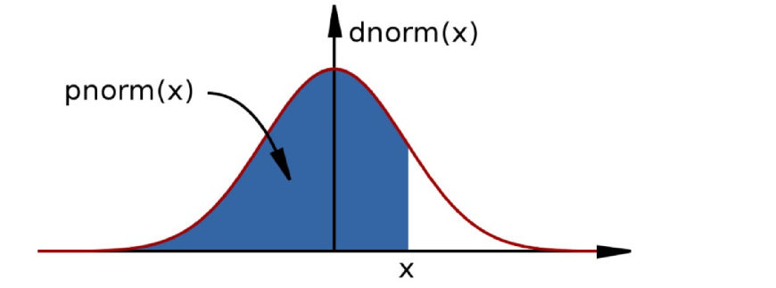

```{r include = FALSE}
library(knitr)
opts_chunk$set(comment = NA) # eliminates hashtag from R outputs
```

## Day 2 Schedule

1. Further customisation of plots
2. Statistics
3. Data Manipulation Techniques
4. Programming in R
5. Further report writing

#1. Further customisation of plots

## Recap

- We have seen how to use `plot()`, `boxplot()` , `hist()` etc to make simple plots
- These come with arguments that can be used to change the appearance of the plot
    + `col`, `pch`
    + `main`, `xlab`, `ylab`
    + etc....
- We will now look at ways to modify the plot appearance after it has been created
- Also, how to export the graphs 


## The painter's model

- R employs a painter's model to construct it's plots
- Elements of the graph are added to the canvas one layer at a time, and the picture built up in levels.
- Lower levels are obscured by higher levels, 
    + allowing for blending, masking and overlaying of objects.

## Example data

- We will re-use the patients data from yesterday:

```{r}
age    <- c(50, 21, 35, 45, 28, 31, 42, 33, 57, 62)
weight <- c(70.8, 67.9, 75.3, 61.9, 72.4, 69.9, 63.5, 
            71.5, 73.2, 64.8)
firstName  <- c("Adam", "Eve", "John", "Mary", "Peter", 
                "Paul", "Joanna", "Matthew", "David", "Sally")
secondName <- c("Jones", "Parker", "Evans", "Davis",
                "Baker","Daniels", "Edwards", "Smith", 
                "Roberts", "Wilson")

consent <- c(TRUE, TRUE, FALSE, TRUE, FALSE, FALSE,
             FALSE, TRUE, FALSE, TRUE)

sex <- c("Male", "Female", "Male", "Female", "Male", 
         "Male", "Female", "Male", "Male", "Female")
```

## Example data

```{r}
patients <- data.frame(First_Name = firstName, 
                       Second_Name = secondName, 
                       Full_Name = paste(firstName, secondName), 
                       Sex = factor(sex),
                       Age = age,
                       Weight = weight,
                       Consent = consent,
                       stringsAsFactors = FALSE)
```


##Initial plot

- Recall our patients dataset from yesterday
    + we might want to display other characteristics on the plot, e.g. gender of individual:

```{r, fig.height=5}
plot(patients$Age, patients$Weight, pch=16)
```

##The points function

- `points()` can be used to set of points to an *existing* plot
- It requires a vector of x and y coordinates
    + These do not have to be the same length as the number of points in the initial plot:
        + Hence we can use `points()` to highlight observations
        + ...or add a set of new observations
```{r fig.height=4}
plot(patients$Age, patients$Weight, pch=16)
points(40,68, pch="X")
```

- Note that axis limits of the existing plot are not altered

## Creating a blank plot

- Often it is useful to create a blank 'canvas' with the correct labels and limits

```{r, fig.height=5}
plot(patients$Age, patients$Weight, type="n")
```

## Adding points to differentiate gender

- Selecting males using the **`==`** comparison we saw yesterday
    + Gives a `TRUE` or `FALSE` value
    + Can be used to index the data frame
    + Which means we can get the relevant Age and Weight values
```{r}
males <- patients$Sex == "Male"
```
```{r, eval=FALSE}
males
patients[males,]
patients[males, "Age"]
patients[males, "Weight"]
```

## Adding points to differentiate gender

```{r, fig.height=5}
plot(patients$Age, patients$Weight, type="n")
points(patients$Age[males], patients$Weight[males], 
       pch=16, col="steelblue")

```


## Adding points to differentiate gender


```{r}
females <- patients$Sex == "Female"
females
patients[females,]
```

## Adding points to differentiate gender

```{r, fig.height=5}
plot(patients$Age, patients$Weight, type="n")
points(patients$Age[males], patients$Weight[males],
       pch=16, col="steelblue")
points(patients$Age[females], patients$Weight[females],
       pch=16, col="orangered1")

```


##Adding points

- Each set of points can have a different colour and shape
- Axis labels and title and limits are defined by the plot
- You can add points ad-nauseum. Try not to make the plot cluttered!
- Once you've added points to a plot, they cannot be removed
- A call to `plot` will start a new graphics window
    - or typing `dev.off()`

```{r fig.height=3,fig.width=8}
plot(patients$Age, patients$Weight, type="n")
points(patients$Age[males], patients$Weight[males],
       pch=16, col="steelblue")
points(patients$Age[females], patients$Weight[females], 
       pch=17, col="orangered1")
```

- TIP: try building the same plot, but using a vector of colors fo the attribute `col`, instead of subselecting the observations


## Adding a legend

- Should also add a legend to help interpret the plot
    + use the `legend` function
    + can give x and y coordinates where legend will appear
    + also recognises shortcuts such as ***topleft*** and ***bottomright***...

```{r fig.height=3,fig.width=8}
plot(patients$Age, patients$Weight, type="n")
points(patients$Age[males], patients$Weight[males], 
       pch=16, col="steelblue")
points(patients$Age[females], patients$Weight[females],
       pch=17, col="orangered1")
legend("topleft", legend=c("M","F"), 
       col=c("steelblue","orangered1"), pch=c(16,17))
```

##Adding text

- Text can also be added to a plot in a similar manner
    + The `labels` argument specifies the text we want to add
    
```{r fig.height=4,fig.width=8}
plot(patients$Age, patients$Weight, pch=16)
text(patients$Age, patients$Weight, labels=patients$Full_Name)
```

##Adding text

- Can alter the positions so they don't interfere with the points of the graph
    
```{r fig.height=3,fig.width=8}
plot(patients$Age, patients$Weight, pch=16,
     xlim=c(10,70), ylim=c(60,75))
text(patients$Age-1, patients$Weight-0.5, 
     labels=patients$Full_Name)
```

- Alternatively, you can use the argument `adj`

## Adding lines

- To aid our interpretation, it is often helpful to add guidelines
    + `grid()` is one easy way of doing this:
```{r,fig.height=5}
plot(patients$Age, patients$Weight, pch=16)
grid(col="steelblue")
```

## Adding lines

- Can also add lines that intersect the axes:
    + `v =` for vertical lines
    + `h =` for horizontal
    + can specify multiple lines in a vector
```{r,fig.height=5}
plot(patients$Age, patients$Weight, pch=16)
abline(v=40, col="red")
abline(h=c(65,70,75), col="blue")
```


## Plot layouts

- The `par` function can be used specify the appearance of a plot
- The settings persist until the plot is closed with **`dev.off()`**
- `?par` and scroll to ***graphical parameters***
- One example is `mfrow`:
    + "multiple figures per row"
    + needs to be a vector of rows and columns:
        + e.g. a plot with one row and two columns `par(mfrow=c(1,2))`
        + don't need the same kind of plot in each cell
        
## Plot layouts    
    
```{r,fig.height=4}
par(mfrow=c(1,2))
plot(patients$Age, patients$Weight, pch=16,
     xlim=c(10,70), ylim=c(60,75))
boxplot(patients$Weight ~ patients$Sex)

```

- See also `mar` for setting the margins:
    + `par(mar=c(...))`
    
## Exporting graphs from RStudio

- Easiest option to to use the *Export* button from the *Plots* panel
- Otherwise, use the `pdf()` function:
    + You will see that the plot does not appear in RStudio
```{r eval=FALSE}
pdf("ExampleGraph.pdf")
plot(rnorm(1:10))
```

- You need to use the `dev.off()` to stop printing graphs to the pdf and 'close' the file
      + It allows you to create a pdf document with multiple pages
```{r eval=FALSE}
dev.off()
```

- pdf is a good choice for publication as they can be imported into Photoshop, Inkscape, etc.
    - Sometimes it is easier to edit in these tools than R!

## Exporting graphs from RStudio

- To save any graph you have created to a pdf, repeat the code you used to create the plot with `pdf()` before and `dev.off()` afterwards
    + you can have as many lines of code in-between as you like
    
```{r}
pdf("mygraph.pdf")
plot(patients$Age, patients$Weight, pch=16)
abline(v=40, col="red")
abline(h=c(65,70,75), col="blue")
dev.off()
```


## Exporting graphs from RStudio

- We can specify the dimensions of the plot, and other properties of the file (`?pdf`)

```{r}
pdf("ExampleGraph.pdf", width=10, height=10)
plot(rnorm(1:10))
dev.off()
```

- Other formats can be created:
    + e.g. ***png***, or others `?jpeg`
    + more appropriate for email, presentations, web page
    
```{r}
png("ExampleGraph.png")
plot(rnorm(1:10))
dev.off()
```

##Exercise: exercise5.Rmd
- Return to the weather data from yesterday:

```{r}
weather <- read.csv("ozone.csv")
```

- Make a scatter plot of all observations of ozone level:
    + i.e. with the y axis being the Ozone variable, and x-axis being the row index
- Highlight any days in the study which had ozone level > 100
- Indicate which month these days with high ozone level belong to

## Target Graph

```{r echo=FALSE}
plot(weather$Ozone,xlab="Day",ylab="Ozone level")
abline(h=100)
highO <- which(weather$Ozone > 100)
points(highO, weather$Ozone[highO],col="red",pch=16)
text(highO,weather$Ozone[highO]-5, labels=weather$Month[highO])
```


## Exercise: exercise5.Rmd

- Using the `par` function, create a layout with three columns
- Plot Ozone versus Solar Radiation, Wind Speed and Temperature on separate graphs
    + use different colours and plotting characters on each plot
- Save the plot to a pdf
- HINT: Create the graph first in RStudio, then when you're happy with it, use the `pdf` function to save to a file

```{r echo=FALSE,fig.height=4,fig.width=10}
par(mfrow=c(1,3))
plot(weather$Solar.R,weather$Ozone,pch=16,col="lightgreen",ylab="Ozone level",xlab="Solar Radiation")
plot(weather$Wind,weather$Ozone, pch=15,col="steelblue",ylab="Ozone level", xlab="Wind Speed")
plot(weather$Temp,weather$Ozone,pch=17,col="orange", ylab="Ozone level",xlab="Temperature")

```

## Solution: solution-exercise5.pdf

```{r,fig.height=5}
plot(weather$Ozone)
abline(h=100)
highO <- which(weather$Ozone > 100)
points(highO, weather$Ozone[highO], col="red", pch=16)
text(highO,weather$Ozone[highO]-5, labels=weather$Month[highO])
```

- Note: check what is the difference of using:
     + `which(weather$Ozone > 100)`, or simply
     + `weather$Ozone > 100`


## Solution

```{r eval=FALSE}
pdf("ozoneCorrelations.pdf")
par(mfrow=c(1,3))
plot(weather$Solar.R, weather$Ozone, pch=16,
     col="lightgreen", ylab="Ozone level",
     xlab="Solar Radiation")
plot(weather$Wind, weather$Ozone, pch=15, 
     col="steelblue", ylab="Ozone level", 
     xlab="Wind Speed")
plot(weather$Temp,weather$Ozone, pch=17,
     col="orange", ylab="Ozone level",
     xlab="Temperature")
dev.off()
```

## Solution

If the graph looks a bit stretched...

```{r eval=FALSE}
pdf("ozoneCorrelations.pdf", width=10,height = 6)
par(mfrow=c(1,3))
plot(weather$Solar.R, weather$Ozone, pch=16,
     col="lightgreen", ylab="Ozone level",
     xlab="Solar Radiation")
plot(weather$Wind, weather$Ozone, pch=15, 
     col="steelblue", ylab="Ozone level", 
     xlab="Wind Speed")
plot(weather$Temp,weather$Ozone, pch=17,
     col="orange", ylab="Ozone level",
     xlab="Temperature")
dev.off()
```


# 2. Statistics
##Built-in support for statistics
- R is a statistical programming language:
    + Classical statistical tests are built-in
    + Statistical modeling functions are built-in
    + Regression analysis is fully supported
    + Additional mathematical packages are available (`MASS`, Waves, sparse matrices, etc)
  
##Distribution functions  
- Most commonly used distributions are built-in, functions have stereotypical names, e.g. for normal distribution:
    + **`pnorm`** - cumulative distribution for x
    + **`qnorm`** - inverse of pnorm (from probability gives x)
    + **`dnorm`** - distribution density
    + **`rnorm`** - random number from normal distribution
  
  
  
- Available for variety of distributions: `punif` (uniform), `pbinom` (binomial), `pnbinom` (negative binomial), `ppois` (poisson), `pgeom` (geometric), `phyper` (hyper-geometric), `pt` (T distribution), pf (F distribution) 

##Distribution functions 
- 10 random values from the Normal distribution with mean 10 and standard deviation 5:
```{r eval=FALSE}
rnorm(10, mean=10, sd=5)
```
- The probability of drawing 10 from this distribution:
```{r}
dnorm(10, mean=10, sd=5)
```

```{r}
dnorm(100, mean=10, sd=5)
```

##Distribution functions (continued)

- The probability of drawing a value smaller than 10:
```{r}
pnorm(10, mean=10, sd=5)
```
- The inverse of `pnorm()`:
```{r}
qnorm(0.5, mean=10, sd=5)
```
- How many standard deviations for statistical significance?
```{r}
qnorm(0.95, mean=0, sd=1)
```

## Example

Recall our histogram of temperature from yesterday:

- The data look to be roughly normally-distributed
- An assumption we rely on for various statistical tests

```{r fig.height=4}
hist(weather$Temp, col="purple", xlab="Temperature",
     main="Distribution of Temperature",
     breaks = 50:100, freq=FALSE)
```

## Create a normal distribution curve

- If our data are normally-distributed, we can calculate the probability of drawing particular values.
      + e.g. a temperature of 80

```{r eval=FALSE}
tempMean <- mean(weather$Temp)
tempSD <- sd(weather$Temp)
dnorm(80, mean=tempMean, sd=tempSD)
```

```{r echo=FALSE}
tempMean <- mean(weather$Temp)
tempSD <- sd(weather$Temp)
```

- We can overlay this on the histogram using `points` as we just saw:
```{r eval=FALSE}
hist(weather$Temp, col="purple", xlab="Temperature",
     main="Distribution of Temperature",
     breaks = 50:100, freq=FALSE)
points(80, dnorm(80, mean=tempMean, sd=tempSD),
       col="red", pch=16)
```

## Create a normal distribution curve

- We can repeat the calculation for a vector of values
    + remember that functions in R are often ***vectorized***
    + use `lines` in this case rather than `points`
    
    ```{r eval=FALSE}
xs <- c(50,60,70,80,90,100)
ys <- dnorm(xs, mean=tempMean, sd=tempSD)
lines(xs, ys, col="red")
```

```{r fig.height=4,echo=FALSE}
hist(weather$Temp,col="purple",xlab="Temperature",
     main="Distribution of Temperature",breaks = 50:100,freq=FALSE)
xs <- c(50,60,70,80,90,100)
ys <- dnorm(xs, mean=tempMean,sd=tempSD)
lines(xs,ys,col="red")
```

## Create a normal distribution curve

- For a smoother curve, use a longer vector:
    + We can generate x values using the `seq()` function

```{r eval=FALSE}
xs <- seq(50,100, length.out = 10000)
ys <- dnorm(xs, mean=tempMean, sd=tempSD)
lines(xs, ys, col="red")
```

```{r fig.height=4,echo=FALSE}
hist(weather$Temp,col="purple",xlab="Temperature",
     main="Distribution of Temperature",breaks = 50:100,freq=FALSE)
xs <- seq(50,100,length.out = 10000)
ys <- dnorm(xs, mean=tempMean,sd=tempSD)
lines(xs,ys,col="red")
```

## Simple testing

- If we want to compute the probability of observing a particular temperature, from the same distribution we can use the standard formula to calculate a t statistic:

$$t = \frac{\bar{x} -\mu_0}{s / \sqrt(n)}$$

```{r}
t <- (tempMean - 50) / (tempSD/sqrt(length(weather$Temp)))
t
```

## Simple testing

- ...or use the **`t.test()`** function to compute the statistic and corresponding p-value

```{r}
t.test(weather$Temp, mu=50)
```


##Two-sample tests: Basic data analysis

- Comparing 2 variances:
    + Fisher's F test
```{r eval=FALSE}
var.test()
```
- Comparing 2 sample means with normal errors:
    + Student's t test
```{r eval=FALSE}
t.test()
```
- Comparing 2 means with non-normal errors:
    + Wilcoxon's rank test
```{r eval=FALSE}
wilcox.test()
```

##Two-sample tests: Basic data analysis
- Comparing 2 proportions:
    + Binomial test
```{r eval=FALSE}
prop.test()
```
- Correlating 2 variables:
    + Pearson's / Spearman's rank correlation
```{r eval=FALSE}
cor.test()
```
- Testing for independence of 2 variables in a contingency table:
    + Chi-squared / Fisher's exact test
```{r eval=FALSE}
chisq.test(); fisher.test()
```

## Statistical tests in R

- Bottom-line: Pretty much any statistical test you care to name will probably be in R
    + This is not supposed to be a statistics course (sorry!)
    + None of them are particular harder than others to use
    + The difficulty is deciding which test to use:
        + whether the assumptions of the test are met, etc.
    + Consult your local statistician if not sure
    + Some good references:
        + [Simple R eBook](https://cran.r-project.org/doc/contrib/Verzani-SimpleR.pdf)
        + [Elements of Statistical Learning eBook](http://statweb.stanford.edu/~tibs/ElemStatLearn/download.html)
        

## Example analysis

- We have already seen that men in our `patients` dataset tend to be heavier than women
- We can **test this formally** in R

```{r echo=FALSE,fig.height=5}
par(mfrow=c(1,2))
plot(patients$Age, patients$Weight,pch=16,type="n")
points(patients$Age[males], patients$Weight[males],pch=16,col="steelblue")
points(patients$Age[females], patients$Weight[females],pch=17,col="orangered1")
legend("topleft", legend=c("M","F"), 
       col=c("steelblue","orangered1"), pch=c(16,17))
boxplot(patients$Weight~patients$Sex)
```

  
## Test variance assumption

```{r}
var.test(patients$Weight~patients$Sex)
```

## Perform the t-test

```{r}
t.test(patients$Weight~patients$Sex, var.equal=TRUE)
```

- This function can be tuned in various ways (`?t.test`):
    - Assumed equal variances, or not (and use Welch's correction)
    - Deal with parired samples
    - Two-sided, or one-sided p-value

##Linear regression: Basic data analysis

- Linear modeling is supported by the function **`lm()`**:
    + `example(lm)` 
    + The output assumes you know a fair bit about the subject

- `lm` is really useful for plotting lines of best fit to XY data, in order to determine intercept, gradient and Pearson's correlation coefficient
    + This is very easy in R

- Three steps to plotting with a best fit line:
    1. Plot XY scatter-plot data
    2. Fit a linear model
    3. Add bestfit line data to plot with `abline()` function
  
##Typical linear regression analysis: Basic data analysis

-  The ~ (***tilde***) is used to define a ***formula***; i.e. "y is given by x"

 
```{r fig.height=5}
x <- c(1, 2.3, 3.1, 4.8, 5.6, 6.3)
y <- c(2.6, 2.8, 3.1, 4.7, 5.1, 5.3)
plot(x,y, xlim=c(0,10), ylim=c(0,10))
```


##Typical linear regression analysis: Basic data analysis

 The ~ is used to define a formula; i.e. "y is given by x"
- Take care about the order of x and y in the plot and lm expressions

```{r,fig.height=5}
plot(x,y, xlim=c(0,10), ylim=c(0,10))
myModel <- lm(y~x)
abline(myModel, col="red")
```

## In-depth summary

```{r}
summary(myModel)
```


##Typical linear regression analysis: Basic data analysis
- Get the coefficients of the fit from:
```{r, eval=FALSE}
coef(myModel)   # Coefficients
resid(myModel)  # Residuals
fitted(myModel) # Fitted values
names(myModel)  # Names of the objects within myModel
```

## Diagnostic plots of the fit

- Get QC of fit from:
```{r,fig.height=5}
par(mfrow=c(2,2))
plot(myModel)
```

##Modelling formulae
- R has a very powerful formula syntax for describing statistical models
- Suppose we had two explanatory variables `x` and `z`, and one response
variable `y`
- We can describe a relationship between, say, `y` and `x` using a tilde `~`,
placing the response variable on the left of the tilde and the explanatory variables on the right:
    + `y~x`
- It is very easy to extend this syntax to do multiple regressions, ANOVAs, to include interactions, and to do many other common modelling tasks. For example
```{r eval=FALSE}
y~x       #If x is continuous, this is linear regression
y~x       #If x is categorical, ANOVA
y~x+z     #If x and z are continuous, multiple regression
y~x+z     #If x and z are categorical, two-way ANOVA
y~x+z+x:z # : is the symbol for the interaction term
y~x*z     # * is a shorthand for x+z+x:z
```


## Exercise: exercise6.Rmd

- There are suggestions that Ozone level could be influenced by Temperature:

```{r echo=FALSE,fig.height=4}
plot(weather$Temp, weather$Ozone,xlab="Temperature",ylab="Ozone level",pch=16)
```

- Perform a linear regression analysis to assess this:
    + Fit the linear model and print a summary of the output
    + Plot the two variables and overlay a best-fit line

## Solution: solution-exercise6.pdf
```{r fig.show=FALSE}
mod1 <- lm(weather$Ozone~weather$Temp)
summary(mod1)
```

## Solution
```{r}
plot(weather$Temp, weather$Ozone, pch=16)
abline(mod1, col="red", lty=2)
```

## Word of caution

***Correlation != Causation***


http://tylervigen.com/spurious-correlations

# 3. Data Manipulation Techniques

## Motivation

- So far we have been lucky that all our data have been in the same file:
    + This is not usually the case
    + Dataset may be spread over several files
        + This takes longer, and is harder, than many people realise
    + We need to combine before doing an analysis


## Combining data from multiple sources: Gene Clustering Example

- R has powerful functions to combine heterogeneous data sources into a single data set
- Gene clustering example data:
    + Gene expression values in ***gene.expression.txt***
    + Gene information in ***gene.description.txt***
    + Patient information in ***cancer.patients.txt***
- A breast cancer dataset with numerous patient characteristics:
    + We will concentrate on ***ER status*** (positive / negative)
    + What genes show a statistically-significant different change between ER groups?


```{r echo=FALSE}

if(!file.exists("gene.expression.txt")){

  if(!require(breastCancerNKI) | require(genefilter)) {
    source("http://www.bioconductor.org/biocLite.R")
    biocLite(c("breastCancerNKI","genefilter"))
  }
  data("nki")
  cancer.patients <- pData(nki)[,c("samplename","age","er","grade")]
  genes <- fData(nki)[,c("probe","HUGO.gene.symbol","Cytoband")]
  
  exprs(nki) <- exprs(nki)[!is.na(genes$HUGO.gene.symbol),]
  
  genes <- genes[!is.na(genes$HUGO.gene.symbol),]
  
  ##get the top50 DE genes, plus 500 random
  ps <- NULL
  for(i in 1:nrow(genes)){
    ps[i] <- t.test(exprs(nki)[i,] ~ factor(cancer.patients$er))$p.value
  }
  
  set.seed(070815)
  ind <- order(ps, decreasing = FALSE)[1:50]
  ind <- sort(c(ind, sample(setdiff(1:nrow(genes),ind),500)))
  
  evalues <- exprs(nki)[ind,]
  genes <- genes[ind,]
  library(org.Hs.eg.db) 
  
  chr <- select(org.Hs.eg.db, columns=c("CHR","CHRLOC"),keys = as.character(genes$HUGO.gene.symbol),keytype = "SYMBOL")
  genes$Chromosome <- chr[match(genes$HUGO.gene.symbol, chr[,1]),2]
  genes$Chromosome <- ifelse(!is.na(genes$Chromosome),paste0("chr", genes$Chromosome),NA)
  genes$Start <- abs(chr[match(genes$HUGO.gene.symbol, chr[,1]),3])
  
  genes <- genes[,-3]
  
  final <- !is.na(genes$Chromosome)
  genes <- genes[final,]
  evalues <- evalues[final,]    


  
  write.table(evalues, file="gene.expression.txt",quote=FALSE,sep="\t")
  write.table(genes, file="gene.description.txt",quote=FALSE,sep="\t")
  write.table(cancer.patients, file="cancer.patients.txt",quote=FALSE,sep="\t")
}
```


## Peek at the data

```{r eval=FALSE}
evals <- read.delim("gene.expression.txt", stringsAsFactors = FALSE)
evals[1:2,1:5]
dim(evals)
```

```{r echo=FALSE}
evals <- read.delim("gene.expression.txt", stringsAsFactors = FALSE)
evals[1:2,1:5]
dim(evals)
```
- `r nrow(evals)` rows and `r ncol(evals)` columns
+ One row for each gene:
    + Rows are named according to particular technology used to make measurement
    + The names of each row can be returned by `rownames(evals)`; giving a vector
+ One column for each patient:
    + The names of each column can be returned by `colnames(evals)`; giving a vector
    
## Peek at the data

```{r}
genes <- read.delim("gene.description.txt",stringsAsFactors = FALSE)
head(genes)
dim(genes)
```


- `r nrow(genes)` rows and `r ncol(genes)` columns
- One for for each gene
- Includes mapping between manufacturer ID and Gene name

## Peek at the data
```{r}
subjects <- read.delim("cancer.patients.txt")
head(subjects)
dim(subjects)
```

- One for each patient in the study
- Each column is a different characteristic of that patient
    + e.g. whether a patient is ER positive or negative

```{r}
table(subjects$er)
```


## Ordering and sorting

To get a feel for these data, we will look at how we can subset and order

- R allows us to do the kinds of filtering, sorting and ordering operations you might be familiar with in Excel
- For example, if we want to get information about patients that are ER negative
    + these are indicated by an entry of ***0*** in the `er` column

```{r eval=FALSE}
subjects$er == 0
```

```{r echo=FALSE}
Biobase:::selectSome(subjects$er==0)

```


## Ordering and sorting

We can do the comparison within the square brackets

- Remembering to include a `,` to index the columns as well
- Best practice to create a new variable and leave the original data frame untouched

```{r}
erNegPatients <- subjects[subjects$er == 0,]
head(erNegPatients)
```

## Ordering and sorting

Sorting is supported by the **`sort()`** function

- Given a vector, it will return a sorted version of the same length

```{r eval=FALSE}
sort(erNegPatients$grade)
```

```{r echo=FALSE}
Biobase:::selectSome(sort(erNegPatients$grade),maxToShow = 20)
```


- But this is not useful in all cases
    + We have lost the extra information that we have about the patients
    
## Ordering and sorting

- Instead, we can use **`order()`**
- Given a vector, `order()` will give a set of numeric values which will give an ordered version of the vector
    + default is smallest --> largest

```{r}
myvec <- c(9,10,4,3,8,5,6,2,1,7)
myvec
order(myvec)
```

- i.e. number in position 9 is the smallest, number in position 8 is the second smallest:

```{r}
myvec[9]
myvec[8]
```

## Ordering and sorting

- We can use the result of `order()` to perform a subset of our original vector
- The result is an ordered vector
```{r}
myvec.ord <- myvec[order(myvec)]
myvec.ord
```

- Implication: We can use `order` on a particular column of a data frame, and use the result to sort all the rows

## Ordering and sorting

- Here we order the `age` column and use the result to re-order the rows in the data frame

```{r}
erNegPatientsByAge <- erNegPatients[order(erNegPatients$age),]
head(erNegPatientsByAge)
```

## Ordering and sorting

- can change the behaviour of `order` to be Largest --> Smallest
```{r}
erNegPatientsByAge <- erNegPatients[order(erNegPatients$age,decreasing = TRUE),]
head(erNegPatientsByAge)
```

- we can write the result to a fie if we wish

```{r eval=FALSE}
write.table(erNegPatientsByAge, file="erNegativeSubjectsByAge.txt", sep="\t")
```


## Exercise: exercise7.Rmd

- Imagine we want to know information about chromosome 8 genes that have been measured.
1. Create a new data frame containing information on genes on Chromosome 8
2. Order the rows in this data frame according to start position, and write the results to a file

## Solution: solution-exercise7.pdf

```{r}
chr8Genes <- genes[genes$Chromosome=="chr8",]
head(chr8Genes)
chr8GenesOrd <- chr8Genes[order(chr8Genes$Start),]
head(chr8GenesOrd)
write.table(chr8GenesOrd, "chromosome8.gene.info.txt", sep="\t")
```


## Retrieving data for a particular gene

 - Gene `ESR1` is known to be hugely-different between ER positive and negative patient
    + let's check that this is evident in our dataset
    + if not, something has gone wrong!
- First step is to locate this gene in our dataset

## Character matching in R

- We have already seen various ways of comparing numeric values
    + ==, >, <
    + each of which returns a vector of logical values
    + == will also work with text
    
```{r}
LETTERS
"A" == LETTERS
```

## Character matching in R
    
- `match()` and `grep()` are often used to find particular matches
    + CAUTION: by default, match will only return the ***first*** match!

```{r}
match("D", LETTERS)
grep("F", rep(LETTERS,2))
match("F", rep(LETTERS,2))
```

## Retrieving data for a particular gene

- Find the name of the ID that corresponds to gene ***ESR1***
    + mapping between IDs and genes is in the ***genes*** data frame
        + ID in first column, gene name in the second
- Save this ID as a variable

```{r}
ind <- match("ESR1", genes$HUGO.gene.symbol)
genes[ind,]
probe <- genes[ind,1]
probe
```


## Retrieving data for a particular gene

Now, find which row in our expression matrix is indexed by this ID

- recall that the rownames of the expression matrix are the probe IDs
- save the expression values as a variable

```{r}
match(probe, rownames(evals))
evals[match(probe, rownames(evals)), 1:10]
genevals <- evals[match(probe,rownames(evals)),]
```


    
## Relating to patient characteristics

We have numeric expression values and want to visualise them against our categorical data

- use a boxplot, for example


```{r}
boxplot(as.numeric(genevals) ~ factor(subjects$er))
```

## Relating to patient characteristics

- The p-value is also encouraging 

```{r}
t.test(as.numeric(genevals) ~ factor(subjects$er))

```


## Complete script

`esr1Example.Rmd`

```{r eval=FALSE}
genes    <- read.delim("gene.description.txt")
subjects <- read.delim("cancer.patients.txt")
evals    <- read.delim("gene.expression.txt", stringsAsFactors = FALSE)

ind      <- match("ESR1", genes[,2])
probe    <- genes[ind,1]
genevals <- evals[match(probe,rownames(evals)),]

boxplot(as.numeric(genevals) ~ factor(subjects$er))
t.test(as.numeric(genevals) ~ factor(subjects$er))
```

## Exercise: exercise8.Rmd

Repeat the same steps we performed for the gene ESR1, but for GATA3:

- Try and make as few changes as possible from the ESR1 script
- Can you see why making a markdown document is useful for analysis?

#4. Programming in R

## Motivation

From the previous exercise, you should see how we can easily adapt our markdown scripts:

- e.g. ESR1 versus GATA3
- But what if we want to analyse many genes?
- It would be tedious to create a new markdown document for every gene
- ...and prone to error too

##Introducing loops

- Many programming languages have ways of doing the same thing many times, perhaps changing some variable each time. This is called **looping**
- Loops are not used in R so often, because we can usually achieve the same thing using vector calculations
- For example, to add two vectors together, we do not need to add each pair of elements one by one, we can just add the vectors
```{r eval=FALSE}
x <- 1:10
y <- 11:20
x+y
```
- But there are some situations where R functions can not take vectors as input. For example, `t.test()` will only test one gene at a time
- What if we wanted to test multiple genes?

##Introducing loops
- We could do this:

```{r eval=FALSE}
t.test(evals[1,] ~ factor(subjects$er))
t.test(evals[2,] ~ factor(subjects$er))

```

- But this will be boring to type, difficult to change, and prone to error
- As we are doing the same thing multiple times, but with a different index each time, we can use a **loop** instead

##Loops: Commands and flow control
- R has two basic types of loop
    + a **`for`** loop: run some code on every value in a vector
    + a **`while`** loop: run some code while some condition is true (*hardly ever used!*)
    
`for` 
```{r loops1, eval=FALSE}
for(i in 1:10) {
  print(i)
  }
```
`while` 
```{r  eval=FALSE}
i <- 1
while(i <= 10 ) {
  print(i)
  i <- i + 1
  }
```

##Loops: Commands and flow control

- Here's how we might use a `for` loop to test the first 10 genes


```{r loops2, eval=FALSE}
for(i in 1:10) {
  t.test(as.numeric(evals[i,]) ~ factor(subjects$er))
  }
```

- This is exactly the same as:

```{r eval=FALSE}
i <- 1
t.test(evals[i,] ~ factor(subjects$er))
i <- 2
t.test(evals[i,] ~ factor(subjects$er))
i <- 3
...
```


## Storing results

However, this for loop is doing the calculations but not storing the results

- The output of `t.test()` is an object with data placed in different slots
    + the `names()` of the object tells us what data we can retrieve, and what name to use
    + N.B it is a "list" object

```{r}
t <- t.test(as.numeric(evals[1,]) ~ factor(subjects$er))
names(t)
t$statistic
```

## Storing results

- When using a loop, we often create an empty "dummy" variable
- This is used store the results at each stage of the loop

```{r}
stats <- NULL
for(i in 1:10) {
  tmp <- t.test(as.numeric(evals[i,]) ~ factor(subjects$er))
  stats[i] <- tmp$statistic
  }
stats
```

## Practical application

Previously we have identified probes on chromosome 8

- Lets say that we want to do a t-test for each gene on chromosome 8
```{r}
head(chr8GenesOrd)
```

- The first step is to extract the expression values for chromosome 8 genes from our expression matrix, which has expression values for all genes
- We can use the `match` function to tell us which rows in the matrix correspond to chromosome 8 genes

```{r}
match(chr8GenesOrd$probe, rownames(evals))
chr8Expression <- evals[match(chr8GenesOrd$probe, rownames(evals)),]
dim(chr8Expression)
```


## Exercise: exercise9.Rmd

- Create a for loop to perform to test if the expression level of each gene on chromosome 8 is significantly different between ER positive and negative samples
- Store the ***p-value*** from each individual test

## Solution: solution-exercise9.pdf

```{r}
pvals <- NULL
for(i in 1:18) {
  tmp <- t.test(as.numeric(chr8Expression[i,]) ~ factor(subjects$er))
  pvals[i] <- tmp$p.value
  }
pvals
```


##Conditional branching: Commands and flow control

- Use an `if` statement for any kind of condition testing
- Different outcomes can be selected based on a condition within brackets

```{r if, eval=FALSE}
if (condition) {
  ... do this ...
  } else {
    ... do something else ...
    }

```

- `condition` is any logical value, and can contain multiple conditions. 
    + e.g. `(a == 2 & b < 5)`, this is a compound conditional argument
- The condition should return a *single* value of `TRUE` or `FALSE`
    
    
    
## Other conditional tests

- There are various tests that can check the type of data stored in a variable
    + these tend to be called **`is...()`**. 
        + try *tab-complete* on `is.`

```{r}
is.numeric(10)
is.numeric("TEN")
is.character(10)
```

- `is.na()` is useful for seeing if an `NA` value is found
    + cannot use `== NA`!

```{r}
match("foo", genes[,2])
is.na(match("foo", genes[,2]))
```


##Conditional branching: Commands and flow control

- Using the **`for`** loop we wrote before, we could add some code to plot the expression of each gene
    + a boxplot would be ideal
- However, we might only want plots for genes with a "significant" pvalue
- Here's how we can use an `if` statement to test for this
    + for each iteration of the the loop:
        1. test if the p-value from the test is below 0.05 or not
        2. if the p-value is less than 0.05 make a boxplot
        3. if not, do nothing
        
```{r flow-control,eval=FALSE}
pdf("Chromosome8Genes.pdf")
pvals <- NULL
for (i in 1:18) {
  tmp <- t.test(as.numeric(chr8Expression[i,]) ~ factor(subjects$er))
  pvals[i] <- tmp$p.value
  if(tmp$p.value < 0.05){
    boxplot(as.numeric(chr8Expression[i,]) ~ factor(subjects$er),
            main=chr8Genes$HUGO.gene.symbol[i])
    }
  } 
pvals
dev.off()

```


##Code formatting avoids bugs!
Compare:
```{r eval=FALSE}
f<-26
while(f!=0){
print(letters[f])
f<-f-1}
```
to:
```{r eval=FALSE}
f <- 26
while(f != 0 ){
  print(letters[f])
  f <- f-1
  }
```
- The code between brackets `{}` *always* is *indented*, this clearly separates what is executed once, and what is run multiple times
- Trailing bracket `}` always alone on the line at the same indentation level as the initial bracket `{`
- Use white spaces to divide the horizontal space between units of your code, e.g. around assignments, comparisons


# 5. Report Writing


## Creating a markdown file from scratch

***File → New File → R Markdown***

- Choose 'Document' and the default output type (HTML)
- A new tab is created in RStudio
- The header allows you to specify a Page title, author and output type
```{r eval=FALSE}
---
title: "Untitled"
author: "Mark Dunning"
date: "18/08/2015"
output: html_document
---
```

## Format of the file

- **Lines 8 - 10**: Plain text description
- **Lines 12 - 14**: An R code 'chunk'
- **Lines 18 to 20**: Another code chunk, this time producing a plot


- Pressing the ***Knit HTML*** button will create the report:
    + Note that you need to 'save' the markdown file before you will see the compiled report in your working directory
    
##Text formatting
See ***?*** → ***Markdown Quick Reference*** in RStudio:

- Enclose text in \* to format in *italics*
- Enclose text in \*\* to format in **bold**
- \*\*\* for ***bold italics***
- \` to format like `code`
- \$ to include equations: $e =mc^2$
- \> quoted text: 

>To be or not to be

- See *Markdown Quick Reference** for more:
    + Adding images
    + Adding web links
    + Tables


## Not quite enough for a reproducible document

- Minimally, you should record what version of R, and the packages you used.
- Use the `sessionInfo()` function
    + e.g. for the version of R I used to make the slides

```{r}
sessionInfo()
```
    

## Defining chunks

- It is not great practice to have one long, continuous R script
- Better to break-up into smaller pieces; '*chunks*'
- You can document each chunk separately
- Easier to catch errors
- The characteristics of each chunk can be modified:
    + You might not want to print the R code for each chunk
    + ...or the output
    + etc.


## Chunk options

Code chunks are encapsulated between backticks. Options for the chunk can be put inside the curly brackets`{...}`

```
'''{r}
my code here...
'''
```

- It's a good idea to name each chunk
    + Easier to track-down errors
- We can display R code, but not run it
    + `eval=FALSE`
- We can run R code, but not display it
    + `echo=FALSE`
    + e.g. setting display options
- Suppress warning messages
    + `warning=FALSE`

    
## Chunk options: eval

- Sometimes we want to format code for display, but not execute; we want to show the code for how we read our data, but want our report to compile quickly

```
'''{r, eval=FALSE}
data <- read.delim("path.to.my.file")
'''
```


## Chunk options: echo

- Might want to load some data from disk
    + e.g. the R object from reading the data in the previous slide
```
'''{r echo=FALSE}
load("mydata.rda")
'''
```
- Your P.I. wants to see your results, but doesn't really want to know about the R code that you used

## Chunk options: results

- Some code or functions might produce lots of output to the screen that we don't need
```{r results='hide'}
for(i in 1:100) {
  print(i)
  }
```

##Chunk options: message and warning

- Loading an R package will sometimes print messages and / or warnings to the screen
- This is not always helpful in a report:
```
'''{r}
library(DESeq)
'''
```

```{r echo=FALSE}
library(DESeq)
```

##Chunk options: message and warning

- Using `message=FALSE` and `warning=FALSE`
```
'''{r message=FALSE, warning=FALSE}
library(DESeq)
'''
```
- Could also need `suppressPackageStartupMessages`

##Chunk options: cache

- The argument `cache=TRUE` will stop certain chunks from being evaluate if their code does not change
- It speeds-up the compilation of the document
    + we don't want to reload our dataset if we've only made a tiny change downstream
```
'''{r echo=FALSE, cache=TRUE}
load("mydata.rda")
'''
```

## Running R code from the main text

- We can add R code to our main text, which gets evaluated
    + make sure we always have the latest figures, p-values etc

```
'''
...the sample population consisted of 'r table(gender)[1]' females 
and 'r table(gender)[2]' males...
'''
```
```{r echo=FALSE}
gender <- c(rep("F", 47), rep("M", 50))
```
...the sample population consisted of  `r table(gender)[1]` females and `r table(gender)[2]` males...

- Alternatively:

```
'''
...the p-value of the t-test is 'r pval', which indicates that...
'''
```
```{r echo=FALSE}
pval <- 0.05
```
...the p-value of the t-test is `r pval`, which indicates that...

- We call this **"in-line" code**

## Running R code from the main text

- Like the rest of our report these R statements will get updated each time we compile the report

```
'''
...the sample population consisted of 'r table(gender)[1]' females
and 'r table(gender)[2]' males...
'''
```

```{r echo=FALSE}
gender <- c(rep("F", 41), rep("M", 54))
```
...the sample population consisted of `r table(gender)[1]` females and `r table(gender)[2]` males...


```
'''
...the p-value of the t-test is 'r pval', which indicates that...
'''
```
```{r echo=FALSE}
pval <- 0.1
```
...the p-value of the t-test is `r pval`, which indicates that...


## Making a heatmap

- A heatmap is often used to visualise how the expression level of a set of genes vary between conditions
- Making the plot is actually quite straightforward
    + providing you have processed the data appropriately!
    + here, we use `na.omit()` to ensure we have no `NA` values
    
```{r}
genelist <- c("ESR1", "NAT1", "SUSD3","SLC7A2" ,"SCUBE2")
probes   <- na.omit(genes[match(genelist, genes[,2]), 1])
exprows  <- match(probes, rownames(evals))

heatmap(as.matrix(evals[exprows,]))
  

```

## Heatmap adjustments

- We can provide a colour legend for the samples
- Adjust colour of cells

```{r}
library(RColorBrewer)
sampcol <- rep("blue", ncol(evals))
sampcol[subjects$er == 1 ] <- "yellow"
rbPal <- brewer.pal(10, "RdBu")
heatmap(as.matrix(evals[exprows,]), ColSideColors = sampcol, col=rbPal)
```

- see also
    + `heatmap.2` from `library(gplots)`; `example(heatmap.2)`
    + `heatmap.plus` from `library(heatmap.plus)`; `example(heatmap.plus)`


## Exercise

This analysis is recorded in `exercise10.Rmd`.

- Use in-line R code to report how many patients were involved in the study
- Hide the code chunk used to produce the plot (`echo=FALSE`)
- Cache the code chunk used to read the raw data (`cache=TRUE`)

Solution: solution-exercise10.Rmd

# End of Course

## Wrap-up

- **Thanks for your attention**
- Practice, practice, practice
    + ... & persevere
- Need inspiration? R code is freely-availabe, so read other people's code!
    + Read [blogs](http://www.r-bloggers.com/)
    + Follow the [forums](http://stackoverflow.com/questions/tagged/r)
    + Download [datasets](http://vincentarelbundock.github.io/Rdatasets/datasets.html) to practice with
    + Bookmark some [reference](https://en.wikibooks.org/wiki/R_Programming) guides
    + on twitter @rstudio, @Rbloggers, @RLangTip
- Please fill in the feedback form for us to improve the course
    
