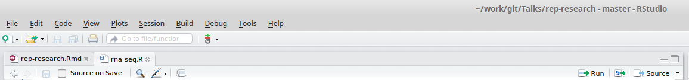

## Day 2 Schedule

1. Further customisation of plots
2. Statistics
3. Report-writing
4. Data Manipulation Techniques
5. Data analysis report

#1. Further customisation of plots

## Recap

- we have seen how to use `plot`, `boxplot` `hist` to make simple plots
- these come with arguments that can be used to change the appearance of the plot
    + `col`, `pch`
    + `main`, `xlab`, `ylab`
    + etc....
- we will now look at ways to modify the plot appearance after it has been created

## The painter's model

- R employs a painter's model to construct it's plots
- Elements of the graph are added to the canvas one layer at a time, and the picture built up in levels. Lower levels are obscured by higher levels, allowing for blending, masking and overlaying of objects.

##Initial plot

- Recall our weather dataset from yesterday
```{r results='hide'}
source("Day_1_scripts/1.2_patients.R")
```

```{r}
plot(patients$Age, patients$Weight,pch=16)
```

##The points function

- `points` can be used to set of points to an *existing* plot
- it requires a vector of x and y coordinates
    + these do not have to be the same length as the number of points in the initial plot
        + hence we can use `points` to highlight observations
        + or add a set of new observations
- Note that axis limits of the existing plot are not altered

```{r}
plot(patients$Age, patients$Weight,pch=16)
points(40,68,pch="X")
```


## Creating a blank plot

- Often it is useful to create a blank 'canvas' with the correct labels and limits

```{r}
plot(patients$Age, patients$Weight,pch=16,type="n")
```

## Adding points to differentiate gender

- Selecting males using the `==` comparison we saw yesterday
    + gives a `TRUE` or `FALSE` value
    + can be used to index the data frame
    + which means we can get the relevant Age and Weight values
```{r}
males <- patients$Sex == "Male"
males
patients[males,]
patients[males,"Age"]
patients[males,"Weight"]
```

## Adding points to differentiate gender

```{r}
plot(patients$Age, patients$Weight,pch=16,type="n")
points(patients$Age[males], patients$Weight[males],pch=16,col="steelblue")

```


## Adding points to differentiate gender


```{r}
females <- patients$Sex == "Female"
females
patients[females,]
```

## Adding points to differentiate gender

```{r}
plot(patients$Age, patients$Weight,pch=16,type="n")
points(patients$Age[males], patients$Weight[males],pch=16,col="steelblue")
points(patients$Age[females], patients$Weight[females],pch=16,col="orangered1")

```


##Adding points

- Each set of points can have a different colour and shape
- Axis labels and title and limits are defined by the plot
- You can add points ad-nauseum. Try not to make the plot cluttered!
- A call to `plot` will start a new graphics window


```{r fig.height=4,fig.width=8}
plot(patients$Age, patients$Weight,pch=16,type="n")
points(patients$Age[males], patients$Weight[males],pch=16,col="steelblue")
points(patients$Age[females], patients$Weight[females],pch=17,col="orangered1")
```


## Adding a legend

```{r fig.height=4,fig.width=8}
plot(patients$Age, patients$Weight,pch=16,type="n")
points(patients$Age[males], patients$Weight[males],pch=16,col="steelblue")
points(patients$Age[females], patients$Weight[females],pch=17,col="orangered1")
legend("topleft", legend=c("M","F"), 
       col=c("steelblue","orangered1"), pch=c(16,17))
```

##Adding text


```{r fig.height=4,fig.width=8}
plot(patients$Age, patients$Weight,pch=16)
text(patients$Age, patients$Weight,labels=patients$Full_Name)
```

##Adding text

- text can also be added to a plot in a similar manner
    + the `labels` argument specifies the text we want to add
    
```{r fig.height=4,fig.width=8}
plot(patients$Age, patients$Weight,pch=16,xlim=c(10,70),ylim=c(60,75))
text(patients$Age-1, patients$Weight-0.5,labels=patients$Full_Name)
```

## Adding lines

- To aid our interpretation, it is often helpful to add guidelines
    + `grid()` is one easy way of doing this.
```{r}
plot(patients$Age, patients$Weight,pch=16)
grid(col="steelblue")
```

## Adding lines

- Can also add lines that intersect the axes
    + `v =` for vertical lines
    + `h=` for horizontal
    + can specify multiple lines in a vector
```{r}
plot(patients$Age, patients$Weight,pch=16)
abline(v=40,col="red")
abline(h=c(65,70,75),col="blue")
```


## Plot layouts

- The `par` function can be used specify the appearance of a plot
- The settings persist until the plot is closed with `dev.off`
- `?par` and scroll to ***graphical parameters***
- One example is `mfrow`
    + multiple figures per row
    + needs to be a vector of rows and columns
        + e.g. a plot with one row and two columns `par(mfrow=c(1,2))`
    
```{r}
par(mfrow=c(1,2))
plot(patients$Age, patients$Weight,pch=16,xlim=c(10,70),ylim=c(60,75))
boxplot(patients$Weight~patients$Sex)

```

##Exercise
- Return to the weather data from yesterday

```{r}
data <- read.csv("Day_1_scripts/ozone.csv")
```

- Make a scatter plot of all daily observations of Ozone level
- Highlight any days which had Ozone level > 100
- Indicate which month the days with high ozone-level belong to

## Target Graph

```{r echo=FALSE}
plot(data$Ozone,xlab="Day",ylab="Ozone level")
abline(h=100)
highO <- which(data$Ozone > 100)
points(highO, data$Ozone[highO],col="red",pch=16)
text(highO,data$Ozone[highO]-5, labels=data$Month[highO])
```

## Solution

```{r}
plot(data$Ozone)
abline(h=100)
highO <- which(data$Ozone > 100)
points(highO, data$Ozone[highO],col="red",pch=16)
text(highO,data$Ozone[highO]-5, labels=data$Month[highO])
```


## Exercise

- Using the `par` function, create a layout with three columns
- Plot Ozone versus Solar Radiation, Wind Speed and Temperature on separate graphs

```{r echo=FALSE}
par(mfrow=c(1,3))
plot(data$Solar.R,data$Ozone,pch=16,col="lightgreen",ylab="Ozone level",xlab="Solar Radiation")
plot(data$Wind,data$Ozone, pch=15,col="steelblue",ylab="Ozone level", xlab="Wind Speed")
plot(data$Temp,data$Ozone,pch=17,col="mistyrose", ylab="Ozone level",xlab="Temperature")

```

## Solution

```{r}

par(mfrow=c(1,3))
plot(data$Solar.R,data$Ozone,pch=16,col="lightgreen",ylab="Ozone level",xlab="Solar Radiation")
plot(data$Wind,data$Ozone, pch=15,col="steelblue",ylab="Ozone level", xlab="Wind Speed")
plot(data$Temp,data$Ozone,pch=17,col="mistyrose", ylab="Ozone level",xlab="Temperature")

```


    
## More-Advanced 

- Modification to include month name and date

```{r}
plot(data$Ozone)
abline(h=100)
highO <- which(data$Ozone > 100)
points(highO, data$Ozone[highO],col="red",pch=16)
text(highO,data$Ozone[highO]-5, labels=paste(month.abb[data$Month[highO]],data$Day[highO]))

```

# 2. Statistics
##Built-in support for statistics
- R is a statistical programming language
    + Classical statistical tests are built-in
    + Statistical modeling functions are built-in
    + Regression analysis is fully supported
    + Additional mathematical packages are available (`MASS`, Waves, sparse matrices, etc)
  
##Distribution functions  
- Most commonly used distributions are built-in, functions have stereotypical names, e.g. for normal distribution
    + `pnorm` - cumulative distribution for x
    + `qnorm` - inverse of pnorm (from probability gives x)
    + `dnorm` - distribution density
    + `rnorm` - random number from normal distribution
  
  
  
- available for variety of distributions: `punif` (uniform), `pbinom` (binomial), `pnbinom` (negative binomial), `ppois` (poisson), `pgeom` (geometric), `phyper` (hyper-geometric), `pt` (T distribution), pf (F distribution) 

##Distribution functions 
- 10 random values from the Normal distribution with mean 10 and standard deviation 5
```{r eval=FALSE}
rnorm(10, mean=10, sd=5)
```
- The probability of drawing 10 from this distribution
```{r}
dnorm(10, mean=10, sd=5)
```

```{r}
dnorm(100, mean=10, sd=5)
```
- The probability of drawing a value smaller than 10
```{r}
pnorm(10, mean=10, sd=5)
```
- The inverse of `pnorm`
```{r}
qnorm(0.5, mean=10, sd=5)
```
- How many standard deviations for statistical significance?
```{r}
qnorm(0.95, mean=0, sd=1)
```

##Two sample tests: Basic data analysis

- Comparing 2 variances
    + Fisher's F test
```{r eval=FALSE}
var.test()
```
- Comparing 2 sample means with normal errors
    + Student's t test
```{r eval=FALSE}
t.test()
```
- Comparing 2 means with non-normal errors
    + Wilcoxon's rank test
```{r eval=FALSE}
wilcox.test()
```

##Two sample tests: Basic data analysis
- Comparing 2 proportions
    + Binomial test
```{r eval=FALSE}
prop.test()
```
- Correlating 2 variables
    + Pearson's / Spearman's rank correlation
```{r eval=FALSE}
cor.test()
```
- Testing for independence of 2 variables in a contingency table
    + Chi-squared / Fisher's exact test
```{r eval=FALSE}
chisq.test();fisher.test()
```


## Example analysis

- We have already seen that men in our Patients dataset tend to be heavier than women
    + we can test this formally in R

```{r echo=FALSE}
par(mfrow=c(1,2))
plot(patients$Age, patients$Weight,pch=16,type="n")
points(patients$Age[males], patients$Weight[males],pch=16,col="steelblue")
points(patients$Age[females], patients$Weight[females],pch=17,col="orangered1")
legend("topleft", legend=c("M","F"), 
       col=c("steelblue","orangered1"), pch=c(16,17))
boxplot(patients$Weight~patients$Sex)
```

  
## Test variance assumption

```{r}
var.test(patients$Weight~patients$Sex)
```

## Perform the t-test


```{r}
t.test(patients$Weight~patients$Sex,var.equal=TRUE)
```

## Exercise

- From our weather dataset, it would appear that the ozone level is higher in the summer months (June or July)
```{r fig.height=4}
boxplot(data$Ozone~data$Month)
```

- Is there sufficient statistical evidence to support this claim?
    + ***Hint**: You need to create a categorical variable to indicate whether a particular measurement was made in the summer or not

## Solution

```{r fig.height=4}
Summer <- data$Month > 6 & data$Month < 9
boxplot(data$Ozone ~ Summer)
t.test(data$Ozone ~ Summer)
```

  
##Linear regression: Basic data analysis

- Linear modeling is supported by the function `lm()`
    + `example(lm)` the output assumes you know a fair bit about the subject

- `lm` is really useful for plotting lines of best fit to XY data in order to determine intercept, gradient & Pearson's correlation coefficient
    + This is very easy in R

- Three steps to plotting with a best fit line
  1. Plot XY scatter-plot data
  2. Fit a linear model
  3. Add bestfit line data to plot with `abline()` function
  
##Typical linear regression analysis: Basic data analysis

-  The ~ (***tilde***) is used to define a ***formula***; i.e. "y is given by x"*

 
```{r fig.height=4}
x <- c(1, 2.3, 3.1, 4.8, 5.6, 6.3)
y <- c(2.6, 2.8, 3.1, 4.7, 5.1, 5.3)
plot(x,y, xlim=c(0,10), ylim=c(0,10))
```


##Typical linear regression analysis: Basic data analysis

 The ~ is used to define a formula; i.e. "y is given by x"
- Take care about the order of x and y in the plot and lm expressions

```{r}
plot(x,y, xlim=c(0,10), ylim=c(0,10))
myModel <- lm(y~x)
abline(myModel)
```

## In-depth summary

```{r}
summary(myModel)
```


##Typical linear regression analysis: Basic data analysis
- Get the coefficients of the fit from:
```{r}
coef(myModel)
resid(myModel)
fitted(myModel)
names(myModel)
```

## Diagnostic plots of the fit

- Get QC of fit from
```{r}
par(mfrow=c(2,2))
plot(myModel)
```

##Modelling formulae
- R has a very powerful formula syntax for describing statistical models
- Suppose we had two explanatory variables `x` and `z` and one response
variable `y`
- We can describe a relationship between, say, `y` and `x` using a tilde `~`,
placing the response variable on the left of the tilde and the explanatory variables on the right:
    + `y~x`
- It is very easy to extend this syntax to do multiple regressions, ANOVAs, to include interactions, and to do many other common modelling tasks. For example
```{r eval=FALSE}
y~x       #If x is continuous this is linear regression
y~x       #If x is categorical, this is ANOVA
y~x+z     #If x and z are continuous, this is multiple regression
y~x+z     #If x and z are categorical, this is two-way ANOVA
y~x+z+x:z # : is the symbol for the interaction term
y~x*z     # * is a shorthand for x+z+x:z
```


## Exercise

- There are suggestions that Ozone level could be influenced by Temperature and Wind speed

```{r echo=FALSE,fig.height=4}
par(mfrow=c(1,2))
plot(data$Temp, data$Ozone,xlab="Temperature",ylab="Ozone level",pch=16)
plot(data$Wind, data$Ozone,xlab="Wind Speed",ylab="Ozone level",pch=16)
```

- Perform a linear regression analysis to assess this
    + fit the linear model and print a summary of the output
    + plot the two variables and overlay a best-fit line

## Solution
```{r fig.show=FALSE}
mod1 <- lm(data$Ozone~data$Temp)
summary(mod1)
```

## Solution

```{r}
mod2 <- lm(data$Ozone~data$Wind)
summary(mod2)
```


## Solution
```{r}
par(mfrow=c(1,2))
plot(data$Temp, data$Ozone,pch=16)
abline(mod1,col="red",lty=2)
plot(data$Wind, data$Ozone,pch=16)
abline(mod2,col="red",lty=2)

```


# 3. Report Writing

##The R scripting language


* A script is a series of instructions that when executed sequentially automates a task
    + A script is a good solution to a repetitive problem
* The art of good script writing is
    + understanding exactly what you want to do
    + expressing the steps as concisely as possible
    + making use of error checking
    + including descriptive comments
* R is a powerful scripting language, and embodies aspects found in most standard programming environments
    + procedrual statements
    + loops
    + functions
    + conditional branching
* Scripts may be written in any standard text editor, e.g. notepad, gedit, kate
    + we will use RStudio

## Principles of Reproducible Research


Sidney Harris - New York Times

## Why should we do reproducible research?

Five selfish reasons - [Florian Markowetz Blog](https://scientificbsides.wordpress.com/2015/07/15/five-selfish-reasons-for-working-reproducibly/) and [slides](http://f1000research.com/slides/4-207)

1. Avoid disaster
2. Easier to write papers
3. Easier to talk to reviewers
4. Continuity of your work in the lab
5. Reputation


##It is a hot topic at the moment

- Statisticians at MD Anderson tried to reproduce results from a Duke paper and unintentionally unravelled a web of incompetence and skullduggery
    + as reported in the ***New York Times***
    


##Hear the full account

- Very entertaining talk from Keith Baggerly in Cambridge 2010

<iframe width="560" height="315" src="https://www.youtube.com/embed/7gYIs7uYbMo" frameborder="0" allowfullscreen></iframe>


##What can we do about it?

- Use scripts / R
- Use version control
- Document early
- Document everything
- Write comments and explanations
- Automatically-generate your plots, tables, etc from the data
    + always ensure that you have the latest version

##Simple example in RStudio
- Lets take Day_1_scripts/1.3_NBcountData.R
    + an analysis of a RNA-seq dataset using edgeR
- Use the Compile Notebook button in RStudio
- Take an R script and turn into HTML, PDF or even Word
- All code will be displayed and the outputs printed
- A compiled report will be generated in your working directory




## What is going on?

- The `knitr` package is being used convert the R script into 'markdown' format, which it then compiles into the output of your choosing
- `knitr` is distributed with RStudio
    + `knitr` is the modern-day equivalent of `Sweave`
- markdown is a easy-to-read, easy-to-write text format often used to write HTML, readme files etc
- the following should create the file `rna-seq.Rmd` in your working directory

```{r eval=FALSE}
library(knitr)
spin(hair="Day_1_scripts/1.3_NBcountData.R",knit=FALSE)
```

## Not quite enough for a reproducible document

- Minimally, you should record what version of R, and the packages you used.
- use the `sessionInfo()` function
    + e.g. for the version of R I used to make the slides
```{r}
sessionInfo()
```

- Lets add this to the R scripts and see what happens


## Defining chunks

- It is not great practice to have one long, continuous R script
- Better to break-up into smaller pieces; '*chunks*'
- You can document each chunk separately
- Easier to catch errors
- The characteristics of each chunk can be modified
    + You might not want to print the R code for each chunk
    + or the output
    + etc

## Create a markdown file from scratch

File - > New File - > R Markdown

- Choose 'Document' and the default output type (HTML)
- A new tab is created in RStudio
- The header also you to specify a Page title, author and output type
```{r eval=FALSE}
---
title: "Untitled"
author: "Mark Dunning"
date: "16/06/2015"
output: html_document
---
```

## Format of the file

- **Lines 8 - 10** Plain text description
- **Lines 12 - 14** An R code 'chunk'
- **Lines 18 to 20** Another code chunk, this time producing a plot


- Pressing the ***Knit HTML*** button will create the report
    + Note that you need to 'save' the markdown file before you will see the compiled report in your working directory
    
##Text formatting
See ***Markdown Quick Reference*** in RStudio

- enclose text in \* to format in *italics*
- enclose text in \*\* to format in **bold**
- \*\*\* for ***bold italics***
- \` to format like `code`
- \$ to include equations: $e =mc^2$
- \> quoted text: 

>To be or not to be

- see Markdown Quick Reference for more 
    + adding images
    + adding web links
    + tables

## Chunk options

- It's a good idea to name each chunk
    + Easier to track-down errors
- We can display R code, but not run it
    + `eval=FALSE`
- We can run R code, but not display it
    + `echo=FALSE`
    + e.g. setting display options
- Suppress warning messages
    + `warning=FALSE`

    
## Chunk options: eval

- Sometimes we want to format code for display, but not execute
    + we want to show the code for how we read our data, but want our report to compile quickly

```
'''{r,eval=FALSE}
data <- read.delim("path.to.my.file")
'''
```


## Chunk options: echo

- might want to load some data from disk
    + e.g. the R object from reading the data in the previous slide
- your P.I. wants to see your results, but doesn't really want to know about the R code that you used
```
'''{r echo=FALSE}
load("mydata.rda")
'''
```

## Chunk options: results

- Some code or functions might produce lots of output to the screen that we don't need
```{r results='hide'}
for(i in 1:100){
  print(i)
}
```

##Chunk options: message and warning

- Loading an R package will sometimes print messages and / or warnings to the screen
    + not always helpful in a report
```
'''{r}
library(DESeq)
'''
```

```{r echo=FALSE}
library(DESeq)
```

##Chunk options: message and warning

- Using `message=FALSE` and `warning=FALSE`
```
'''{r message=FALSE,warning=FALSE}
library(DESeq)
'''
```
- Could also need `suppressPackageStartupMessages`

##Chunk options: cache

- `cache=TRUE` will stop certain chunks from being evaluate if their code does not change
- speeds-up the compilation of the document
    + we don't want to reload our dataset if we've only made a tiny change downstream
```
'''{r echo=FALSE,cache=TRUE}
load("mydata.rda")
'''
```

## Including plots

- Use a plotting function (`plot`, `boxplot`, `hist` etc) will include the plot at the relevant point in the document
```
'''{r}
plot(1:10, jitter(1:10))
'''
```

```{r echo=FALSE}
plot(1:10, runif(10))
```

## Control over plots

```
'''{r fig.height=2,fig.align='right', fig.height=4,fig.width=9}
plot(1:10, jitter(1:10))
'''
```

```{r echo=FALSE,fig.height=3,fig.align='right', fig.height=4,fig.width=9}
plot(1:10, runif(10))
```


## Running R code from the main text

- We can add R code to our main text, which gets evaluated
    + make sure we always have the latest figures, p-values etc

```
.....the sample population consisted of  'r table(gender)[1]' females and 'r table(gender)[2]' males.....
```

```{r echo=FALSE}
gender <- c(rep("F", 47), rep("M", 50))
```
.....the sample population consisted of  `r table(gender)[1]` females and `r table(gender)[2]` males.....


```
.....the p-value of the t-test is 'r pval', which indicates that.....
```
```{r echo=FALSE}
pval <- 0.05
```
.....the p-value of the t-test is `r pval`, which indicates that.....

## Running R code from the main text

- Like the rest of our report these R statements will get updated each time we compile the report

```
.....the sample population consisted of  'r table(gender)[1]' females and 'r table(gender)[2]' males.....
```

```{r echo=FALSE}
gender <- c(rep("F", 41), rep("M", 54))
```
.....the sample population consisted of  `r table(gender)[1]` females and `r table(gender)[2]` males.....


```
.....the p-value of the t-test is 'r pval', which indicates that.....
```
```{r echo=FALSE}
pval <- 0.1
```
.....the p-value of the t-test is `r pval`, which indicates that.....


## Conditional output

```{r}
pval <- 0.1
```


```
.....The statistical test was 'r ifelse(pval < 0.05, "", "not")' significant....
```


The statistical test was `r ifelse(pval < 0.05, "", "not")` significant

```{r}
pval <- 0.01
```


```
.....The statistical test was 'r ifelse(pval < 0.05, "", "not")' significant....
```


The statistical test was `r ifelse(pval < 0.05, "", "not")` significant


## Printing vectors
```
The months of the year are 'r month.name'
```

The months of the year are `r month.name`

## References

- Useful reference:
    +  Reproducible Research in R and RStudio
        + http://christophergandrud.github.io/RepResR-RStudio/
        + Useful exercise is to compile the book from the [source code](https://github.com/christophergandrud/Rep-Res-Book)
    + [Implementing Reproducible Research](https://osf.io/s9tya/wiki/home/)


## Exercise

- Create a new markdown file that will report your analysis of the NB count data
    + File -> New File -> R Markdown
- Create separate code chunks for each stage of the analysis (copy code from Day_1_scripts/1.3_NBcountData.R if you wish)
    + Reading the data
    + Basic Statistics
    + Reorder table by decreasing nuclei count
    + Identify patients with >33% NB amplification
    + Write out results table as comma separated values file
    
## Exercise

- Once you have a report that you are happy with
- Use in-line R code to report how many patients have > 33% amplifications
- Hide the code chunk used to produce the plot (`echo=FALSE`)
- Cache the code chunk used to read the raw data (`cache=TRUE`)

# 4. Data Manipulation Techniques

## Motivation

- So far we have been lucky that all our data have been in the same file
    + This is not usually the case
    + A dataset may be spread over severall files
        + This takes longer, and is harder, than many people realise
    + We need to combine before doing an analysis


##Basic R 'Built-in' functions for working with data frames
- We can get the numbers of rows or columns with `nrow` and `ncol`

```{r programming6}
nrow(patients)
ncol(patients)
dim(patients)
```


##Basic R 'Built-in' functions for working with data frames

- We can add rows or columns to a data frame using rbind and cbind
```{r echo=FALSE}
options(width=80)
```

```{r data-frames1}
newpatient <- c("Kate", "Lawson", "Kate Lawson", "Female", "35", "62.5","TRUE")
rbind(patients,newpatient)
```

##Basic R 'Built-in' functions for working with data frames

```{r data-frames2}
cbind(patients,10:1)

```

##Basic R 'Built-in' functions for working with data frames

- We can also remove rows and columns
```{r}
patients[-1, ] # remove first row
```

##Basic R 'Built-in' functions for working with data frames

- We can also remove rows and columns
```{r}
patients[ ,-1] # remove first column
```


##Introducing loops

- Many programming languages have ways of doing the same thing many times, perhaps changing some variable each time. This is called *looping*
- Loops are not used in R so often, because we can usually achieve the same thing using vector calculations
- For example, to add two vectors together, we do not need to add each pair of elements one by one, we can just add the vectors
```{r eval=FALSE}
x<- 1:10
y <- 11:20
x+y
```
- But there are some situations where R functions can not take vectors as input. For example, `read.csv` will only load one file at a time
- What if we had ten files to load in, all ending in the same extension (like `.csv`)?

##Introducing loops
- We could do this:

```{r echo=FALSE}
rawData <- read.delim("Day_1_scripts/1.3_NBcountData.txt")
splitData <- split(rawData,cut(rawData[,1],breaks=seq(0,nrow(rawData),length.out=5)))
for(i in 1:length(splitData)){
  write.csv(splitData[[i]], file=paste0("Day_2_scripts/NBCounts-Batch",i,".csv"),quote=FALSE,row.names=FALSE)
}

```


```{r eval=FALSE}
rawData  <-data.frame() # Start with empty data frame
rawData1 <- read.csv("NBCounts-Batch1.csv")
rawData2 <- read.csv("NBCounts-Batch2.csv")
rawData3 <- read.csv("NBCounts-Batch3.csv")
  ...
rawData <- rbind(rawData1, rawData2, rawData3, ..., )
```
- But this will be boring to type, difficult to change, and prone to error
- As we are doing the same thing multiple times, but with a different file name each time, we can use a **loop** instead

##Loops: Commands and flow control
- R has two basic types of loop
    + a `for` loop: run some code on every value in a vector
    + a `while` loop: run some code while some condition is true
    
`for` 
```{r loops1, eval=FALSE}
for(i in 1:10){
  print(i)
}
```
`while`
```{r  eval=FALSE}
i <- 1
while ( i <= 10 ) {
   print(i)
   i <- i + 1
}
```

##Loops: Commands and flow control

- Here's how we might use a `for` loop to load in our CSV files
- If the data files are in your current working directory, we can look up files
containing a particular substring in their name using the `dir` function


```{r eval=FALSE}
dir(pattern="NBCounts.csv")
```

```{r echo=FALSE}
dir("Day_2_scripts/",pattern="Counts.csv")

```

- So we can load all the files using a `for` loop as follows

```{r loops2, eval=FALSE}
rawData <- data.frame()
countfiles <- dir(pattern="NBCounts")
for (file in countfiles) {
   t <- read.csv(file)
   rawData <- rbind(rawData, t)
}
```

- Here, we use a temporary variable `t` to store the data in each file, and then add that data to the main `colony` data frame.

##Conditional branching: Commands and flow control

- Use an `if` statement for any kind of condition testing
- Different outcomes can be selected based on a condition within brackets

```{r if, eval=FALSE}
if (condition) {
... do this ...
} else {
... do something else ...
}

```

- `condition` is any logical value, and can contain multiple conditions. 
    + e.g. `(a == 2 & b < 5)`, this is a compound conditional argument

##Conditional branching: Commands and flow control
- For example, if we were writing a script to load an unknown set of files, using the `for` loop we wrote before, we might want to warn the user if we can't find any files with the pattern we are searching for. Here's how we can use an `if` statement to test for this

```{r flow-control,eval=FALSE}
rawData <- data.frame()
countfiles <- dir(pattern="NBCounts")
if (length(countfiles) == 0) {
    stop("No Counts.csv files found!")
} else {
    for (file in countfiles) {
        t <- read.csv(file)
        rawData <- rbind(rawData, t)
    }
}

```

- The `stop` function outputs the error message and quits


##Code formatting avoids bugs!
Compare:
```{r eval=FALSE}
f -26
while(f!=0){
print(letters[f])
f <- f-1}
```
to:
```{r eval=FALSE}
f <- 26
while( f != 0 ){
   print(letters[f])
   f <- f-1
}
```
- The code between brackets `{}` *always* is *indented*, this clearly separates what is executed once, and what is run multiple times
- Trailing bracket `}` always alone on the line at the same indentation level as the initial bracket `{`
- Use white spaces to divide the horizontal space between units of your code, e.g. around assignments, comparisons

##Exercise

- Modify your Markdown file from the previous section to incorporate the new code to read from different files


# 5. Data analysis report example

```{r echo=FALSE}

if(!file.exists("Day_2_scripts/gene.expression.txt")){

  if(!require(breastCancerNKI) | require(genefilter)) {
    source("http://www.bioconductor.org/biocLite.R")
    biocLite(c("breastCancerNKI","genefilter"))
  }
  data("nki")
  cancer.patients <- pData(nki)[,c("samplename","age","er","grade")]
  genes <- fData(nki)[,c("probe","HUGO.gene.symbol")]
  ##get the top50 DE genes, plus 500 random
  ps <- NULL
  for(i in 1:nrow(genes)){
    ps[i] <- t.test(exprs(nki)[i,] ~ factor(cancer.patients$er))$p.value
  }
  set.seed(070815)
  ind <- order(ps, decreasing = FALSE)[1:50]
  ind <- sort(c(ind, sample(setdiff(1:nrow(genes),ind),500)))
  
  evalues <- exprs(nki)[ind,]
  genes <- genes[ind,]
  
  write.table(evalues, file="Day_2_scripts/gene.expression.txt",quote=FALSE,sep="\t")
  write.table(genes, file="Day_2_scripts/gene.description.txt",quote=FALSE,sep="\t")
  write.table(cancer.patients, file="Day_2_scripts/cancer.patients.txt",quote=FALSE,sep="\t")
}
```

## Combining data from multiple sources: Gene Clustering Example

- R has powerful functions to combine heterogeneous data into a single data set
- Gene clustering example data
    + gene expression values in ***Day_2_scripts/gene.expression.txt***
    + patient information in ***Day_2_scripts/gene.description.txt***
    + gene information in ***Day_2_scripts/cancer.patients.txt***
    
## Peek at the data

```{r}
evals <- read.delim("Day_2_scripts/gene.expression.txt",stringsAsFactors = FALSE)
evals[1:5,1:5]

```

## Peek at the data
```{r}
genes <- read.delim("Day_2_scripts/gene.description.txt")
head(genes)
```

## Peek at the data
```{r}
subjects <- read.delim("Day_2_scripts/cancer.patients.txt")
head(subjects)
```


## Retrieving data for a particular gene

```{r}
ind <- match("ESR1", genes[,2])
probe <- genes[ind,1]
evals[match(probe,rownames(evals)),1:10]
genevals <- evals[match(probe,rownames(evals)),]
```

## Relating to patient characteristics

```{r}
boxplot(as.numeric(genevals)~factor(subjects$er))
t.test(as.numeric(genevals)~factor(subjects$er))
```

## Extracing multiple genes

```{r}
genelist <- c("ESR1", "NAT1", "SUSD3","SLC7A2" ,"SCUBE2")
probes <- genes[match(genelist,genes[,2]),1]
subset <- evals[match(probes,rownames(genes)),]
```

## 

```{r}
par(mfrow=c(5,2))
for(i in 1:length(genelist)){
  boxplot(as.numeric(subset[i,])~factor(subjects$er))
  t.test(as.numeric(subset[i,])~factor(subjects$er))
}
```


## Making a heatmap

```{r}
heatmap(as.matrix(evals[match(probes,rownames(genes)),]))
```

## Compiling the report

- See the markdown document gene-report.Rmd
- 