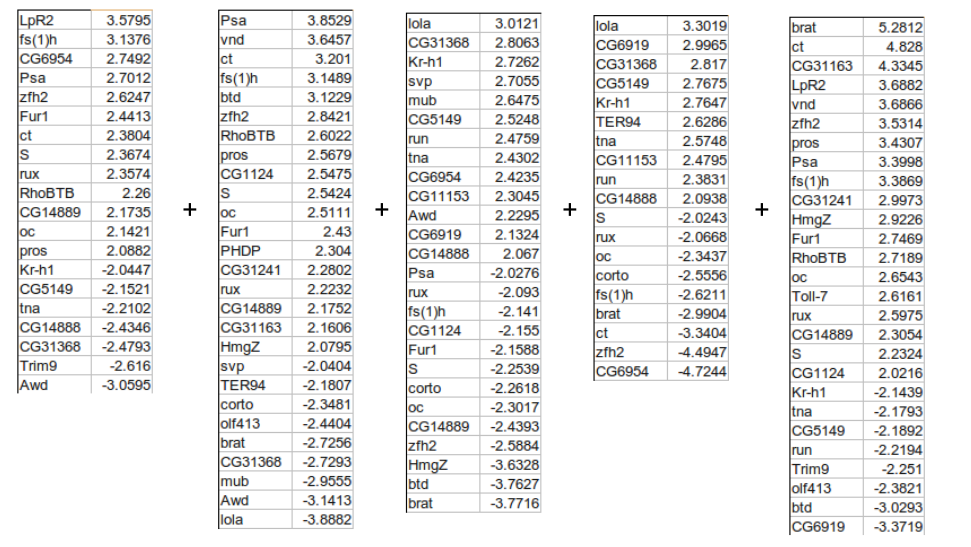
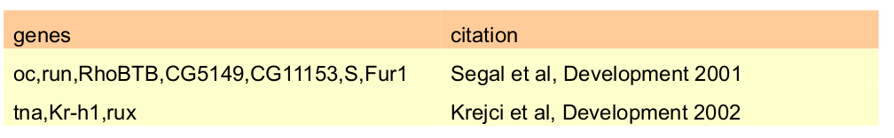
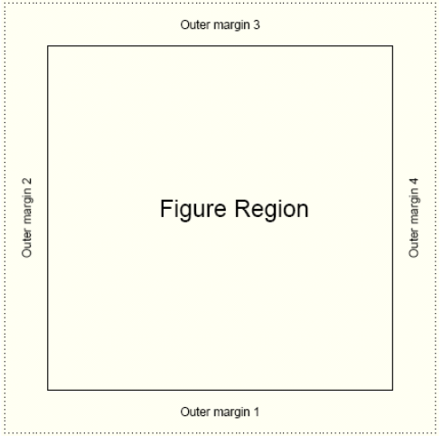
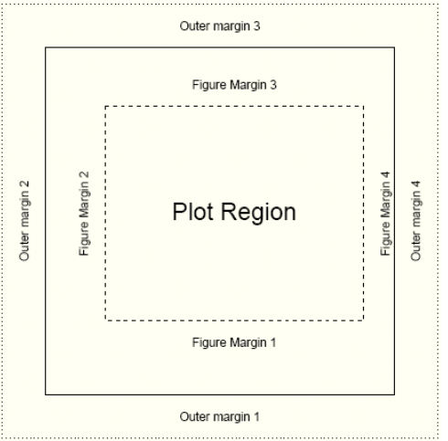
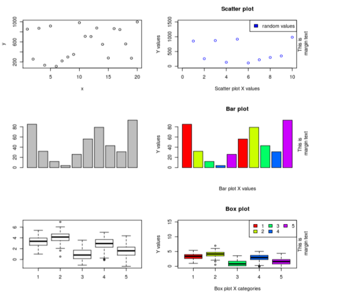

# 1. Statistics
##Built-in support for statistics
- R is a statistical programming language
    + Classical statistical tests are built-in
    + Statistical modeling functions are built-in
    + Regression analysis is fully supported
    + Additional mathematical packages are available (`MASS`, Waves, sparse matrices, etc)
  
##Distribution functions  
- Most commonly used distributions are built-in, functions have stereotypical names, e.g. for normal distribution
  + `pnorm` - cumulative distribution for x
  + `qnorm` - inverse of pnorm (from probability gives x)
  + `dnorm` - distribution density
  + `rnorm` - random number from normal distribution
  
  
  
- available for variety of distributions: `punif` (uniform), `pbinom` (binomial), `pnbinom` (negative binomial), `ppois` (poisson), `pgeom` (geometric), `phyper` (hyper-geometric), `pt` (T distribution), pf (F distribution) 

##Distribution functions 
- 10 random values from the Normal distribution with mean 10 and standard deviation 5
```{r eval=FALSE}
rnorm(10, mean=10, sd=5)
```
- The probability of drawing 10 from this distribution
```{r}
dnorm(10, mean=10, sd=5)
```

```{r}
dnorm(100, mean=10, sd=5)
```

##Distribution functions 
- The probability of drawing a value smaller than 10
```{r}
pnorm(10, mean=10, sd=5)
```
- The inverse of `pnorm`
```{r}
qnorm(0.5, mean=10, sd=5)
```
- How many standard deviations for statistical significance?
```{r}
qnorm(0.95, mean=0, sd=1)
```

##Two sample tests: Basic data analysis

- Comparing 2 variances
```{r eval=FALSE}
var.test()
```
- Comparing 2 sample means with normal errors
```{r eval=FALSE}
t.test()
```
- Comparing 2 means with non-normal errors
```{r eval=FALSE}
wilcox.test()
```
- See also `prop.test()`, `cor.test()`, `chisq.test()`, `fisher.test()`


##Comparison of 2 data sets example: Basic data analysis

- Men, on average, are taller than women.
  1. Determine whether variances in each data series are different. 
    + Variance is a measure of sampling dispersion, a first estimate in determining the degree of difference
    + e.g. Fishers' F test
  2. Comparison of the mean heights. e.g. Student's t test, Wilcoxon's rank sum test
    + Determine probability that mean heights are really drawn from different sample populations
    + e.g. Student's t-test, Wilcoxon's rank sum test
  
##Comparison of 2 data sets example .Fishers F test

- Read in the data file into a new object, `heightData`
```{r eval=FALSE}
heightData <- read.csv("1.5_heightData.csv")
```
- **attach** the data frame so we don't have to refer to it by name all the time
```{r eval=FALSE}
attach(heightData)
```
- Do the two sexes have the same variance?
```{r eval=FALSE}
var.test(Female,Male)
```

```{r echo=FALSE}
options(width=40)
setwd("Day_2_scripts/")
heightData <- read.csv("1.5_heightData.csv")
attach(heightData)
var.test(Female,Male)
```

##Comparison of 2 data sets example. Student' t test
- Student's t test is appropriate for comparing the difference in mean height in our data. 
      + We need a one-tailed test
      + Choose value of `var.equal` argument based on results of previous slide
```{r}
t.test(Female, Male, alternative="less",var.equal=TRUE)
```

##Comparison of 2 data sets example. Review findings

```{r}
boxplot(heightData)
```

##Linear regression: Basic data analysis

- Linear modeling is supported by the function `lm()`
    + `example(lm)` the output assumes you know a fair bit about the subject

- `lm` is really useful for plotting lines of best fit to XY data in order to determine intercept, gradient & Pearson's correlation coefficient
    + This is very easy in R

- Three steps to plotting with a best fit line
  1. Plot XY scatter-plot data
  2. Fit a linear model
  3. Add bestfit line data to plot with `abline()` function
  
##Typical linear regression analysis: Basic data analysis

 
```{r fig.height=4}
x <- c(1, 2.3, 3.1, 4.8, 5.6, 6.3)
y <- c(2.6, 2.8, 3.1, 4.7, 5.1, 5.3)
plot(y~x, xlim=c(0,10), ylim=c(0,10))
```


##Typical linear regression analysis: Basic data analysis

```{r echo=FALSE}
myModel <- lm(y~x)
```


```{r}
plot(y~x, xlim=c(0,10), ylim=c(0,10))
abline(myModel)
```
##Summary of the linear model object: summary(myModel)
```{r}
summary(myModel)
coef(myModel)
resid(myModel)
fitted(myModel)
```

##Modelling formulae
- R has a very powerful formula syntax for describing statistical models
- Suppose we had two explanatory variables `x` and `z` and one response
variable `y`
- We can describe a relationship between, say, `y` and `x` using a tilde `~`,
placing the response variable on the left of the tilde and the explanatory variables on the right:
    + `y~x`
- It is very easy to extend this syntax to do multiple regressions, ANOVAs, to include interactions, and to do many other common modelling tasks. For example
```{r eval=FALSE}
y~x       #If x is continuous this is linear regression
y~x       #If x is categorical, this is ANOVA
y~x+z     #If x and z are continuous, this is multiple regression
y~x+z     #If x and z are categorical, this is two-way ANOVA
y~x+z+x:z # : is the symbol for the interaction term
y~x*z     # * is a shorthand for x+z+x:z
```


##Exercise: The coin toss

To learn how the distribution functions work, try simulating tossing a fair coin 100 times and then show that it is fair

- We can model a coin toss using the binomial distribution. Use the `rbinom` function to generate a sample of 100 coin tosses. Look up the binomial distribution help page to find out what arguments this function needs
- How many heads or tails were there in your sample? You can do this in two ways; either select the number of successes using indices, or convert your sample to a factor and get a summary of the factor
- If we toss a coin 50 times, what is the probability that we get exactly 25 heads? What about 25 heads or less? Use `dbinom` and `pbinom` to find out
- The argument to `dbinom` is a vector, so try calculating the probabilities for getting any number of coin tosses from 0 to 50 in fifty trials using `dbinom`. Plot these probabilities using `plot`. Does this plot remind you of anything?

##Coin toss answers
- To simulate a coin toss, give `rbinom` a number of observations, the number of trials for each observation, and a probability of success

```{r}
coin.toss <- rbinom(100, 1, 0.5)
```
- Because we only specified one trial per observation, we either have an outcome of 0 or 1 successes. To get the number of successes, use indices or a factor to look up the number of 1s in the coin.toss vector (your numbers will vary)
```{r}
length(coin.toss[coin.toss==1])
summary(factor(coin.toss))
```

##Coin toss answers
- The probability of getting exactly 25 heads from 50 observations of a fair coin
```{r}
dbinom(25, 50, 0.5)
```
- The probability of getting 25 heads or less from 50 observations of a fair coin
```{r}
pbinom(25, 50, 0.5)
```


##Coin toss answers
- The probabilities for getting all numbers of coin tosses from 0 to 50 in fifty trials
```{r}
dbinom(0:50, 50, 0.5)
```

##Coin toss answers

- To plot this distribution, which should resemble a normal distribution
```{r}
plot(dbinom(0:50, 50, 0.5))
```

##Exercise: Linear modelling example
Mice have varying numbers of babies in each litter. Does the size of the litter affect the average brain weight of the offspring? We can use linear modelling to find out. (This example is taken from John Maindonald and John Braun's book Data Analysis and Graphics Using R (CUP, 2003), p140-143.)

- Install and load the `DAAG` package. The `litters` data frame is part of this package. Take a look at it. How many variables and observations does it have? Does `summary` tell you anything useful? What about `plot`?
- Are any of the variables correlated? Look up the `cor.test` function and use it to test for relationships.

##Exercise: Linear modelling example

- Use `lm` to calculate the regression of brain weight on litter size, brain weight on body weight, and brain weight on litter size and body weight together
- Look at the coefficients in your models. How is brain weight related to litter size on its own? What about in the multiple regression? How would you interpret this result?

##Linear modelling answers

- To install and load the package and look at `litters`

```{r echo=FALSE,message=FALSE,warning=FALSE,include=FALSE}
if(!require(DAAG)) install.packages("DAAG",repos = c("CRAN" = "http://cran.ma.imperial.ac.uk"))
```

```{r eval=FALSE}
install.packages("DAAG")
```


```{r}
library(DAAG)
attach(litters)
head(litters)
summary(litters)
```

##Linear modelling plotting

```{r}
plot(litters)
```

##Linear modelling answers


- To calculate correlations between variables

```{r}
cor.test(brainwt, lsize)
cor.test(bodywt, lsize)
cor.test(brainwt, bodywt)
```

##Linear modelling answers

- To calculate the linear models
```{r}
lm(brainwt~lsize)
```

```{r}
plot(lsize,brainwt)
abline(lm(brainwt~lsize))
```


##Linear modelling answers
```{r}
lm(brainwt~bodywt)
```

```{r}
plot(bodywt,brainwt)
abline(lm(brainwt~bodywt))
```


##Linear modelling answers
```{r}
lm(formula = brainwt ~ lsize + bodywt)
```

- *Interpretation*: brain weight decreases as litter size increases, but brain weight increases proportional to body weight (when bodywt is held constant, the lsize coefficient is positive: 0.00669). This is called 'brain sparing'; although the offspring get smaller as litter size increases, the brain does not shrink as much as the body


# 2. Writing custom scripts for data analysis

##The R scripting language


* A script is a series of instructions that when executed sequentially automates a task
    + A script is a good solution to a repetitive problem
* The art of good script writing is
    + understanding exactly what you want to do
    + expressing the steps as concisely as possible
    + making use of error checking
    + including descriptive comments
  
##The R scripting language

* R is a powerful scripting language, and embodies aspects found in most standard programming environments
    + procedrual statements
    + loops
    + functions
    + conditional branching
  
* Scripts may be written in any standard text editor, e.g. notepad, gedit, kate
    + we will use RStudio

##Colony forming experiment

* We have been asked y some collaborators to analyse some trial data to see if an experiment will work
* We are interested in the behaviour of a gene, X, which is involved  in a cell proliferation pathway
* This pathway causes cells to proliferate in the presence of a compound, Z
* Gene X turns the pathway off, reducing cell proliferation
* Our collaborators want to test what happens when we knock down X in the presence of Z
* To do this, they want to grow cell colonies in the presence of Z, with or without X, and count the number of colonies that result

##Initial Trial

* Our collaborators have sent us a first batch of test data, growing colonies in different concentrations of compound Z, and replicating each Z concentration three times
* Does increasing concentration of Z have an effect on colony growth?
* We want to do the following:
    + Load the data into R
    + Plot the data to inspect them
    + Calculate an Analysis of Variance to see if the growth is influenced by Z concentration
    + Calculate the mean growth for each level of Z concentration, to see the direction of change
    
##Initial trial exercise

* The trial data are in the file '2.1\_colony\_trial.csv'. Load this file into R using the command we learnt yesterday
* Plot the data using a formula, to see how Z affects colony Count. Recall how we did this earlier with linear modelling, with independant variable x and dependent variable y: `plot(y~x)`
* Calculate an analysis of variance for the data. The R function for ANOVA is `aov`, which works like `lm()` from earlier
* There are four concentrations of Z, and each concentration has been replicated three times. What is the mean colony count for each concentration? See if you can figure out a way to calculate this with what we learnt yesterday. You will need to use logical indexing and you may want to use a loop

##Walkthrough - Importing the data

* Use `read.csv` to load the data

```{r eval=TRUE,echo=FALSE}
setwd("Day_2_scripts/")
colony <- read.csv("2.1_colony_trial.csv")
```


```{r eval=FALSE}
colony <- read.csv("2.1_colony_trial.csv")
```

```{r echo=FALSE}
colony
```


##Walkthrough - Importing the data

```{r echo=FALSE}
colony[1:4,]
```


* The data frame has three columns; Z, Replicate and Count. We want to know how Z affects the number of colonies (Count). To do this, we need to summarise the data over all replicates for each concentration of Z.
* We will attach the data frame to our workspace, so we can refer to the variables without referring to the data frame all the time

```{r}
attach(colony)
```

##Walkthrough - Plotting

* We want to plot the colony growth in response to changing Z concentration.
* Z is the explanatory variable and Count is the response variable

```{r fig.height=4}
plot(Count ~ Z)
```

##Walkthrough - Plotting

* We can improve on this. Firstly, we want to order the Z categories. Z is a factor, so we need to supply new levels to this factor in the colony data frame

```{r fig.height=4}
Z  <- factor(Z, levels=c("None", "Low",
                         "Medium", "High"))
plot(Count ~ Z)
```

##Walkthrough - Analysis of Variance

* We can use the same formula syntax to calculate an analysis of variance:

```{r}
colony.aov <- aov(Count~Z)
summary(colony.aov)
```

This tells us what we can already see from the plot, that there is a highly significant relationship between Z concentration and colony growth

##Calculating group means

* We can calculate a mean for a particular group like this:
```{r}
mean(colony[Z == "None",]$Count)
mean(colony[Z == "Low",]$Count)
mean(colony[Z == "Medium",]$Count)
mean(colony[Z == "High",]$Count)


```

##Calculating group means

* We could generalise this with a for loop:

```{r}
for (z in levels(Z)){
  print(mean(colony[Z==z,]$Count))
}
```
* But there is a better way

##The tapply function

* The apply family of functions allow us to group data by variable and calculate something for each group

* Assume we have the following data for heights of 5 males and females

```{r}
data <- data.frame(gender = c("M","M","F","F","F"),
                   height = c(6,6.1,5.8,6,5.95))
data
```
* How can we get the mean of males and females separately?

##The tapply function

* The `tapply` function lets us do exactly this

```{r eval=FALSE}
tapply(data, groups, function)
```

* in our case:
```{r}
tapply(data$height, data$gender, mean)
```

##Using tapply on colony

* We can use tapply to calculate group means on colony like this:

```{r fig.height=4}
colony.means <- tapply(Count, Z, mean)
colony.means
barplot(colony.means)
```

##A complete script

* We now have a complete script to analyse these data
```{r eval=FALSE}
#Load data, order Z and plot
colony <- read.csv("2.1_colony_trial.csv")
colony$Z <- factor(colony$Z, c("None", "Low", "Medium", "High"))
attach(colony)
plot(Count ~ Z)
#Analysis of variance
colony.aov <- aov(Count ~ Z)
print(summary(colony.aov))
#Calculate group means
colony.means <- tapply(Count, Z, mean)
print(colony.means)
barplot(colony.means)
detach(colony)
```
* 2.1\_colony\_1.R


# 3. User functions

## Introducing user functions

* All R commands are function calls
* Functions take some input, perform calculations on that input, and return some output
* e.g. `sqrt` is a function that takes a value, calculates the square root of the value, and returns the square root
* `aov` takes a formula referring to some data, calculate the analysis of variance for that data, and returns the model it calculated
* We can define our own functions. User functions extend the capabilities of R by adapting or creating new tasks that are tailored to your specific requirements
*  User functions are objects, just like vectors and data frames. This has a few useful implications

##Defining a new function

* A function has a name, arguments, procedural steps, and a return value
```{r}
sqXplusX <- function(x){
  x^2 +x
}
```

* `sqXplusX` is the function name
* `x` is the single argument to this function and it exists only within the function
* everything between the brackets `{}` are procedural steps
* the last calculated value is the function return value. We can call `return` explictly
```{r}
sqXplusX(10)
```

## Named and default arguments

* We can generalise our function by adding a second argument

```{r}
powXplusX <- function(x, power=2){
  x^power + x
}
```
* The `power` argument has a default value of 2; if we don't supply a power when we call the function, `x` will be squared
* Arguments without a default value are required, those with default values are optional
```{r}
powXplusX(10, 3) #arguments are matched based on position
powXplusX(x=10, power=3) # arguments matched based on name
```

## Calculation with user functions

* User functions can be used wherever a built-in function can be used:

```{r eval=FALSE}
#make some example data
a <- matrix(1:100, ncol=10, byrow=TRUE) 
sqXplusX(a)
```

* Functions are R objects, just like a vector or a data frame, and exist in our workspace

```{r}
sqXplusX
```

## Variable scope

* Objects created in functions are not available to the global environment unless returned. They are limited to the scope of the function
```{r}
addone <- function(x) {x <- x+1; x}
x <-1
addone(x)
x
```

## Variable scope

* The `x` in the global environment has nothing to do with the `x` declared in the function, and is unchanged by the call to the function. To update the global `x`, we would need to assign the return value of the function

```{r}
x <- addone(x)
```

* A function can only return one object, but that object can be a list, so if you have many objects to return, package them up into a list first


## Script / function tips

* If your script repeats the same command with different values more than twice, you should consider writing a function to generalise that command

* Writing functions makes your code more easily understandable because they encapuslate a procedure into a well-defined boundary with consistent input/output

* Functions should only do one thing. If a function is doing multiple tasks, try to split it up into multiple functions. This rule of thumb means functions tend to be short, not more than around one or two screens of code

* Look at other functions to get ideas for how to write your own.
    + Display function code by entering the function's name without brackets `()`
    
## Checking input and reporting errors

* A function should fail gracefully if it does not receive valid input when it is called. We can use `if` statements to check for appropriate input

* R has two useful commands to tell the user something is wrong. `warning` prints a message and continues to run the function. `stop` ends the function after printing the message.

* For example, we might rewrite our `powXplusX` function to check that the power argument is a whole number:

```{r}
powXplusX <- function(x, power=2){
  if(power %% 1 != 0) stop ("Power should be a whole number")
  x^power + x
}
```

## Checking input and reporting errors

```{r}
powXplusX(10, 3)
```

```{r eval=FALSE}
powXplusX(10, 3.5)

```

```{r echo=FALSE}
err <- try(powXplusX(10, 3.5),silent = TRUE)
```

```{r echo=FALSE}
message(err[1])
```


## Checking input and reporting errors

* R has a very useful set of functions called the `is` family, which check the type of input values. For example:

```{r}
sqXplusX <- function(x){
  if (is.numeric(x)){
    x^2 + x
  } else {
    stop("Input should be numeric")
  }
}
```

```{r}
sqXplusX(10)
```


## Checking input and reporting errors


```{r eval=FALSE}
sqXplusX("ten")

```

```{r echo=FALSE}
err <- try(sqXplusX("ten"), silent = TRUE)
```

```{r echo=FALSE}
message(err[1])
```
The `is.` family consists of; `is.character`, `is.null`,`is.na` `is.data.frame` etc. For full list, type the following and press `TAB`
```{r eval=FALSE}
is.
```

## Checking input and reporting errors

* Here's another, more concise way to do the same thing:

```{r}
sqXplusX <- function(x){
  if(!is.numeric(x)) stop("Input should be numeric")
  x^2 + x
}
```

* This is not only shorter, but it also gets all the error checking out of the way before the main processing stesp

* You may also find the `%in%` command useful, which checks to see if the elements of one vector are present in another

## Checking input and reporting errors

```{r}
levels(colony$Z)
"Low" %in% colony$Z
"Zero" %in% colony$Z
c("None", "Low") %in% colony$Z
```

## Temperature conversion exercise

* Centigrade to Fahrenheit conversion is given by F = 9/5 *C +32

* Write a function that converts between temperatures

* The function should take two named arguments
    + temperature `t` is numeric
    + units `unit` is character
* Both arguments should have appropriate default values
* The function should report an appropriate error if inappropriate values are given
    + `if(!is.numeric(t)) { ...}`
    + `if(!(unit %in% c("c","f"))) {...}`
* The function should print out the temperature in Fahrenheit if given in Centigrade, and vice-versa    


## Building the solution

* It is difficult to write large chunks of code. Instead, start with something that works and build upon it
* e.g. to solve the temperature conversion exercise:
    + write a skeleton function definition (e.g. just a name and brackets)
    + add appropriate argument names and defaults
    + write code to convert Centigrade to Fahrenheit and check it works
    + write code to convert Fahrenheit to Centigrade and check it works
    + add error-checking code, including the checks from the previous slide, and any others you can think of
    + write a set of test calls to confirm that your function handles correct and incorrect input
* If you get stuck, call us for help

##Temperature conversion exercise

```{r}
convTemp <- function(t=0, unit="c"){
    if(!is.numeric(t)) stop("Non numeric 
                            temperature entered")
    if(!unit %in% c("c","f")){
    stop("Unrecognised temperature unit")
  }
  converted <- 0
  # conversion for centigrade
  if(unit == "c"){
    converted <- 9/5 * t + 32
  }
  #conversion for Fahrenheit
  if(unit == "f"){
    converted <- 5/9 * (t - 32)
  }
  converted
}


```

# 4. Advanced data processing

## Combining data from multiple sources

* R has powerful functions to combine heterogeneous data into a single data set
* Gene clustering example data
    + five sets of differentially expressed genes from various experimental conditions
    + file with names of experimentally-verified genes
* Gene clustering exercise
    + combine this dataset into a single table and cluster to see which conditions are similar
    + repeat the clustering but only on a subset of experimentally-verified genes
    
## Combining gene tables

* input files have two columns: gene names and fold change
* we want to combine all five tables into a single table, with 0 for missing values


## Gene Clustering 

* To make the big table we first need to find out all the genes present in at least one of the files
* Make sure not to use factors in `read.delim()`
    + when loading in character data, use `as.is=TRUE` to prevent it being converted to factors
    + `union()` is a set operation which combines two vectors by eliminating duplicates. See also `intersect` and `setdiff`

```{r eval=FALSE}
#start with an empty collection of genes
genes <- c()
for(fileNum in 1:5){
  #load in files 2_3.DiffGenes1.tsv...
  t <- read.delim(paste("2.3_DiffGenes", fileNum, ".tsv"
                        , sep="")
                  , as.is=TRUE, header=FALSE)
  #label the input columns to help code readability
  names(t) <- c("gene", "expression")
  genes <- union(genes, t$gene)
}
#for tidiness order our genes by name
genes <- sort(genes)
genes #show all genes
```


## Gene Clustering

* Using the complete list of genes, we can create the big table and fill in the values:
    + `match()` returns the index of the first argument in the second. i.e. index of input file genes in the big table
    + we use index to pick the rows in such way that they match the order in the input file
    
```{r eval=FALSE}
#make the destination table [rows=unique genes,cols=file numbers]
values <- matrix(0, nrow=length(genes), ncol=5)
rownames(values) <- genes
for(fileNum in 1:5){
  #read in the file again
    t <- read.delim(paste("2.3_DiffGenes", fileNum,".tsv"
                        , sep=""), as.is=TRUE, header=FALSE)
    names(t) <- c("gene","expression")
    index <- match(t$gene, rownames(values))
    values[index,fileNum] <- t$expression
}
```

## Gene Clustering

* Now we can do hierarchical clustering:
    + Values from the matrix are colour-coded. Rows and columns are re-arranged according to similarity

```{r eval=FALSE,fig.height=4}
heatmap(values, scale="none", col=cm.colors(256))
```

```{r echo=FALSE}
setwd("Day_2_scripts/")
genes <- c()
for(fileNum in 1:5){
  t <- read.delim(paste("2.3_DiffGenes", fileNum, ".tsv"
                        , sep="")
                  , as.is=TRUE, header=FALSE)
  names(t) <- c("gene", "expression")
  genes <- union(genes, t$gene)
}
genes <- sort(genes)
values <- matrix(0, nrow=length(genes), ncol=5)
rownames(values) <- genes
for(fileNum in 1:5){
    t <- read.delim(paste("2.3_DiffGenes", fileNum, ".tsv"
                        , sep=""), as.is=TRUE, header=FALSE)
    names(t) <- c("gene", "expression")
    index <- match(t$gene, rownames(values))
    values[index, fileNum] <- t$expression
}
heatmap(values, scale="none", col=cm.colors(256))

```

## Gene Clustering 

* In a second part of our analysis, we want to produce the same heatmap but only based on a list of experimentally-verified genes

* The problem is that the data are not formatted in the most convenient way:




## Gene Clustering

* We load in this table, and only extract the gene names, then we use them to select a subset of the `values` matrix
```{r eval=FALSE}
t.exp <- read.delim("2.3_ExperimentalGenes.tsv",
                    as.is=TRUE)
experim.genes <- unlist(strsplit(t.exp$genes, ","))
```
* `unlist` flattens out a nested list into a single vector
* `strsplit` splits a vector of strings by a custom split character (`,`). The result is a list of split values for each element of the input vector
* Now, redo the heatmap by using just the genes in the experimentally verified set  
```{r eval=FALSE}
is.experimental <- rownames(values) %in% experim.genes
heatmap(values[is.experimental,], scale="none"
        , col=cm.colors(256))
```

## Gene Clustering Review

* We load the five tables twice - first to collect gene names, then to load expression values
* Based on the expression table (`values`) we construct a clustered heatmap first on the whole set of genes, then on a selected subset
* Go through the code, try it out and understand it
* Try answering the following questions
    + what is `rownames(values)`
    + why is `rownames(values)[index]` and `t$gene` giving the same output?
    + what is the difference between `rownames(values) %in% experim.genes` and `experim.genes %in% rownames(values)`
  
# 5. Graphics

## Starting out with R grapics

* R provides several mechanisms for producing graphical output
    + Functionality depends on the level at which the user seeks interaction with R
* High-level graphics
    + Functions compute an appropriate chart based upon the information provided. Optional arguments may tailor the chart as required
    + Interaction is at traditional graphics system level. The user isn't required to know much about anything
* Low-level grpahics
    + The user interacts with the drawing device to build up a picture of the chart piece-by-piece
    + This fine granular control is only required if you seek to do something exceptional
* R graphics produces plots using a painters' model
    + Elements of the graph are added to the canvas one layer at a time, and the picture built up in levels. Lower levels are obscured by higher levels, allowing for blending, masking and overlaying of objects.
    
## Essential plotting - plot

* `plot()` is the main function for plotting, it takes x, y values to plot and also lots of graphical parameters (see `?par` for all of them)

* Default plotting

```{r fig.height=4}
x <- 1:5
y <- 2:6
plot(x,y)
```

## Essential plotting - plot

* Custom plotting

```{r fig.height=4}
x <- 1:5
y <- 2:6
plot(x,y, xlab="X data", ylab="Y data", 
     xlim=c(0,10), ylim=c(0,10),
     main="Our title")
```


## R graphics uses a painters' model

```{r fig.height=4}
x <- seq(-2,2,0.1)
y <- sin(x)
plot(x,y, ylim=c(-1.5,1.5),
     xlim=c(-2.5,2.5),
     col="red", pch=16,
     cex=1.4)
```

## R graphics uses a painters' model

```{r echo=FALSE}
x <- seq(-2, 2, 0.1)
y <- sin(x)
plot(x,y, ylim=c(-1.5,1.5),
     xlim=c(-2.5,2.5),
     col="red", pch=16,
     cex=1.4)
lines(x, y, ylim=c(-1.5,1.5),
      xlim=c(-2.5,2.5), col="blue",
      lty=1, lwd=2)
```

```{r eval=FALSE}
lines(x, y, ylim=c(-1.5,1.5),
      xlim=c(-2.5,2.5), col="blue",
      lty=1, lwd=2)
```

## R graphics uses a painters' model

```{r echo=FALSE}
x <- seq(-2, 2, 0.1)
y <- sin(x)
plot(x, y, ylim=c(-1.5,1.5),
     xlim=c(-2.5,2.5),
     col="red", pch=16,
     cex=1.4)
lines(x, y, ylim=c(-1.5,1.5),
      xlim=c(-2.5,2.5), col="blue",
      lty=1, lwd=2)
rect(-2.5, 0, 2.5, -1.5, col="white", border="white")
```

```{r eval=FALSE}
rect(-2.5, 0, 2.5, -1.5,
     col="white", border="white")

```

## Plotting arguments we used
- `xlim`,`ylim`; axis limits
- `col`; line colour
- `pch`; plotting character
- `cex`; character expansion
- `lty`; line type
- `lwd`; line width

- See more arguments with
```{r eval=FALSE}
?par
```


## Plotting x, y data - plot(), points(), lines()

* `plot` is used to start a new plot, accepts x,y data, but also data from some objects (like linear regression), Use the parameter `type` to draw points, lines etc (see `?plot`)

* `points()` is used to add points to an existing plot
* `lines()` is used to add lines to an existing plot

```{r fig.height=4}
# draw as line from (0,0) to (5,5)
plot(c(0,5), c(0,5), type="l")
# add a point at 1,3
points(1,3)
```


## Making bar plots barplot()

* Visualizing a vector of data can be done with bar plots, using the function `barplot()`

```{r fig.height=4}
data <- c("2000"=0, "2001"=20, "2002"=50,"2003"=100)
barplot(data, main="Number of R developes")
```

## Making box plots - boxplot()

* When a spread of data needs to be visualised, we can use boxplots with the function `boxplot()`

```{r fig.height=4}
data1 <- rnorm(1000,mean=0)
data2 <- rnorm(1000, mean=1)
boxplot(data1,data2)
```

##Making histograms - hist()

* When we need to look at the distribution of data, we can visualise it using histograms with the function `hist()`

```{r fig.height=4}
data <- rnorm(1000)
hist(data)
```

## Typical plotting workflow

* Set the plot layout and stlye - `par()`
    + set the number of plots you want per page
    + set the outer margins of the figure region (the distance between the edges of the page and the figure region, or between adjacent plots if there are multiple figures per page)
    + set the inner margins of the plot (the distance between the plot axes and the labels and titles)
    + set the styles for the plot (colours, fonts, line styles and weights)
* Draw the plot `plot(x, y, ...)`    

## Setting graphics layout and style - par()

* `par()` top-level graphics function
    + parameter specifies various page settings. These are inherited by subordinate functions, if no other styles are set
    + specific colours and styles may be set globally with `par`, but change ad-hoc in plotting commands
    + the global setting will remain unchanged, and reused in future plotting calls
    + `par` sets the size of page and figure margins (margin spacing is in lines)
    + `par` is responsible for controlling the number of figures that are plotted on a page
    + `par` may set global colouring of axes, text, background, foreground, line styles (solid/dashed), if figures should be boxed or open etc, etc...
* type `par()` to get a list of top-down settings that may be set globally

## Page settings with par
```{r eval=FALSE}
#one figure on page
par(mfrow=c(1,1))
#equal outer margins
par(oma=c(2,2,2,2))
```


## Page settings with par
```{r eval=FALSE}
par(mar=c(5,4,4,2))
```
* Sets space for x and y labels, a main title, and a thin margin on the right
    + Numbering: bottom, left, top, right



## Plotting characters for plot(), size and orientation

* `pch=`
    + sets on of the 26 standard plotting characters used. Can also use characters, such as `"."`

* `cex=`
    + character expansion. Sets the scaling factor of the printing character
* `las=` 
    + Axes label style: 1 = normal, 2= rotated 90 degrees. 
    
    
## Plotting characters for plot(), size and orientation

```{r echo=FALSE}
par(mar=c(0.1,0.1,0.1,0.1))
i <- 0:24

x <- floor(i /5) + 1
y <- i %%5

plot(1:10, type="n", xlim = c(1,5), ylim=c(-1,5),axes=F,xlab="",ylab="")
points(x,y,pch=i+1)
text(x,y-0.3,i+1)
```


## Annotating the plot

* `plot` accepts main title, subtitle, X label, Y label as standard arguments
    + `plot(x, y, main="...", sub="...", xlab="...", ylab="...")`
    + `mtext(text = "...", side="")` allows text to be written directly into the margin of a plot
    + `text(x, y, labels="...")` allows text to be written in the plot at coordinates x,y
    + `legend(x, y, legend="...")` produces a legend for the plot
    
  
## Use of colour in R

* Colour is usually expressed as a hexadecimal code of Red, Green and Blue counterparts
    + no good for humans
    
* R supports numerous colour palettes which are available through several colour functions
    + `colours()` get inbuilt names of known colours
    + `rgb()` converts red, green, blue intensities to colours
    
```{r eval=FALSE}
rgb(1,1,1)
par(mfrow=c(2,2))
plot(1:10, col="#FF00FF")
plot(1:10, col=rgb(1,0,1))
plot(1:10, col="magenta")
```

## Colour ramps and palettes

* Heatmaps use colour depth to convey data values. Cold colours are typically low values, and light colours are high-state values. This is a colour ramp

* R supports numerous graded colour charts. Specify `n` to set the number of gradations required in the palette

```{r eval=FALSE}
rainbow(n)
heat.colors(n)
terrain.colors(n)
topo.colors(n)
cm.colors(n)

```

## Colour packages: RColorBrewer

* This add-on package provides a series of well-defined colour palettes. The colours in these palettes are selected to permit maximum visual discrimination

* To access the `RColorBrewer` packages

```{r eval=FALSE}
library(RColorBrewer)
display.brewer.all()
#see all available palettes
myCol <- brewer.pal(n,"...")
#n = number of colours, "..." is the palette name
```


## Colour packages: RColorBrewer
```{r echo=FALSE}
library(RColorBrewer)
display.brewer.all()

```


## Saving plots to files

* Unless specified, R plots all graphics to the screen
* To send plots to a file, you need to set up an appropriate graphics device

```{r eval=FALSE}
postscript(file = "a_name.ps",...)
pdf(file  = "a_name.pdf",...)
jpeg(file = "a_name.jpg",...)
png(file  = "a_name.png",...)
```

## Saving plots to files

* Each graphics device will have a specific set of arguments to dictate characteristics of the outputted file
    + `height=, width=, horizontal=, res=, paper=`
    + Top tip: A4 @ 300 dpi, portrait, size in pixels
    + Postscript and pdf work in inches by default, A4 = 8.3" x 11.7"
* Graphics devices need closing when printing is finished: `dev.off()`
```{r eval=FALSE}
png("tenPoints.png", width=300, height=300)
plot(1:10)
dev.off()
```

## Thoughts when plotting to a file

* Its very tempting to send all graphical output to a pdf file. Caution
    + For high resolution publication-quality images you need postscript. Set up postscript file capture with `postscript("a_file.ps", paper="a4")`
    + Postscript images can be converted to JPEG using ghostscript (free to download) for low resolution lab book photos and talks
    + PDF images will grow too large for Acrobat to render if plots contain many data points (e.g. Affymetrix MA plots)
    + Automatically send multiple page outputs to separate image files using `file = somename%02d.jpg`
    + Don't forget to close graphics devices (i.e. the file) by using `dev.off()`

## Graphics exercise

* Exercise
    + Make a full A4 page figure comprising of 6 plots: 2 each of XY plot (`plot()`), barchart (`barplot()`) and box plots (`boxplot()`)
    + The two versions of each plot should consist of: the default plot and a customised plot (change for instance colours, range, captions)
    + Output the completed 6-panel figure to: screen, jpeg, postscript and pdf file
    
* Suggested route to solution
    + Generate some plotting data appropriate to each type of plot
    + Write the code to produce the six plots, once plotting the data by using the default plotting, one with some customisations
    + To output the plot to screen, jpeg, postscript and pdf you will need to redo the plot multiple times. Create a function to do the plotting and call it by redirecting graphical output to screen, jpeg file, postscript file and pdf file

* An example solution `20_6PanelPlotscript.R`

## Example output



#References

##References
* Official documentation on:
    + http://cran.r-project.org/manuals.html
* A good repository of R recipes
    + Quick-R: http://www.statmethods.net/
* Don't forget that many packages come with tutorials (vignettes)
* R forums
    + http://stackoverflow.com/questions/tagged/r
    + http://news.gmane.org/gmane.comp.lang.r.general
    
* Plenty of textbooks to choose from, comprehensive list + reviews
    + http://www.r-project.org/doc/bib/R-books.html

#End of Course

##Thanks for your attention

- Please fill-in your feedback so we can improve the course
- The key to learning R is practice, practice, practice!
    + If you don't have your own data yet, look online
    + http://vincentarelbundock.github.io/Rdatasets/datasets.html
- Meet with fellow R users
    + http://www.meetup.com/Cambridge-R-Users-Group-Meetup/
    + informal, quarterly talks
- Look our for an 'Intermediate R' course    

    
